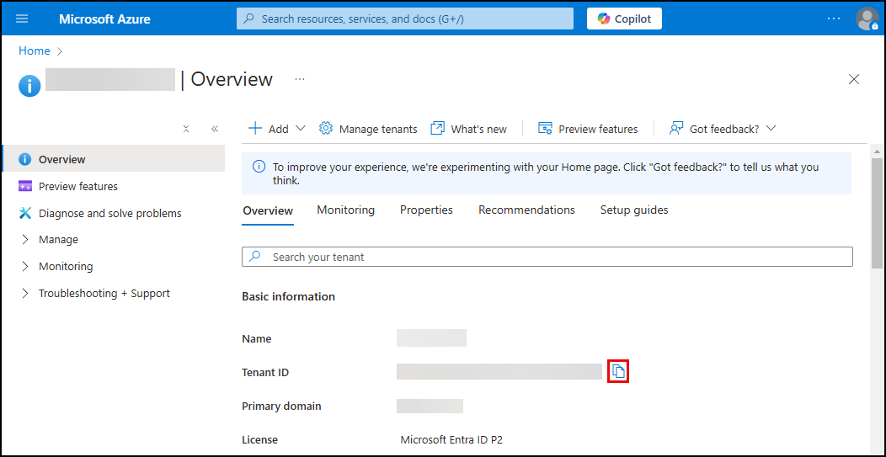
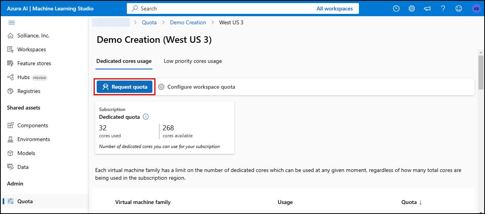

# 2.4 Verify Azure Quota

This solution contains an Azure Developer CLI `azd-template` that provisions the required resources in Azure and deploys the starter app to Azure Container Apps (ACA). The template allows for the infrastructure to be deployed with a single `azd up` command.

- [X] Verified your Azure ML CPU quota
- [X] Authenticated with Azure
- [X] Provisioned Azure resources and deployed the starter solution

## Verify Azure ML CPU Quota

This solution accelerator contains a section dedicated to setting up and using a Semantic Ranking model directly from your PostgreSQL database. The deployment of this component of the architecture requires sufficient CPU quota (4 or 16 cores) in Azure Machine Learning to accommodate your choice of either of the following models:

- [Hugging Face miniLM re-ranker model deployment](https://huggingface.co/cross-encoder/ms-marco-MiniLM-L6-v2). Smaller model, high accuracy, requiring 4 cores.
- [Hugging Face BGE re-ranker model deployment](https://huggingface.co/BAAI/bge-reranker-v2-m3). Larger model, highest accuracy, requiring 16 cores.

In this task, you must verify you have available quota for the target virtual machine (VM) instance type (`STANDARD_D4AS_V4` or `STANDARD_D16AS_V4`), and if not, request additional quota.

1. To view your available quota, you first need to retrieve your Microsoft Entra ID **Tenant ID** from the [Azure portal](https://portal.azure.com/).

2. In the Azure portal, enter "Microsoft Entra ID" into the search bar, then select **Microsoft Entra ID** from the **Services** list in the results.

    

3. On the **Overview** page of your Microsoft Entra ID tenant, select the **Copy to clipboard** button for your **Tenant ID**.

    

4. Open a new browser window or tab and navigate to the following URL, replacing the `<your-tenant-id>` token with the Tenant ID you copied from the Entra ID overview page in the Azure portal.

    ```bash title="Azure ML Quota page" linenums="0"
    https://ml.azure.com/quota?tid=<your-tenant-id>
    ```

5. On the Azure ML **Quota** page, select the subscription you are using for this workshop.

    

6. On the quota page for your selected subscription, select the Azure region you plan to use for this workshop. This should be the region you chose in previous task that supports the required Azure OpenAI models.

7. You should now see a list of CPUs and their quotas within your subscription. Locate **Standard DASv4 Family Cluster Dedicated vCPUs** in the list and inspect the **Quota** available.

    

8. If you have (4 cores for the mini model, or 16 cores for the bge model) or more available, then you do not need to request a quota increase. Otherwise, select the **Standard DASv4 Family Cluster Dedicated vCPUs** by checking the box to the left of the name, then scroll up to the top of the page and locate the **Request quota** button.

    

9. In the **Request quota** dialog, increase your **New cores limit** value by (4 or 16) and then select **Submit**.

    

    !!! example "Quota increase example"

        Your **new cores limit** should be increased to ensure (4 or 16) cores are available for a new deployment. For example, if you have zero cores available, your new cores limit should be set to (4 or 16). If your core limit is 100 and you are currently using 90, your new cores limit should be set to (94 or 106).

10. Quota increase requests typically take a few minutes to complete. You will receive notifications in the Azure portal as the request is processed and when it completes.

11. If your request is denied, you don't have permissions to issue the request, or you prefer not to request additional quota, you have the option to exclude the **Semantic Ranking** model deployment when running the `azd up` command by setting the `deployAMLModel` flag to `none` when prompted.

## Verify Azure Resource Providers

There are a few Azure Resource Providers that will need to be registered on the Azure Subscription for the solution accelerator to successfully deploy the Azure Machine Learning resources.

The required Azure Resource Providers are:

- `Microsoft.Cdn`
- `Microsoft.PolicyInsights`
- `Microsoft.MachineLearningServices`
- `Microsoft.ApiManagement`

Follow these steps to check if the Resource Providers are registered, and if not then you'll register them:

1. Run the following command to check whether the Resource Providers are registered on your Azure Subscription:

    ```azurecli
    az provider list --query "[?namespace=='Microsoft.Cdn' || namespace=='Microsoft.PolicyInsights' || namespace == 'Microsoft.MachineLearningServices' || namespace == 'Microsoft.ApiManagement'].{Namespace: namespace, RegistrationState: registrationState}" -o table
    ```

    Alternatively, you could also navigate to the **Subscription** within the **Azure Portal**, then navigate to **Resource providers** under **Settings**. This will also allow you to view the registered Resource Providers for the Subscription, as well as register them.

    The console output will look similar to the following:

    ```text
    Namespace                          RegistrationState    
    ---------------------------------  -------------------  
    Microsoft.MachineLearningServices  NotRegistered        
    Microsoft.Cdn                      Registered           
    Microsoft.PolicyInsights           NotRegistered        
    Microsoft.ApiManagement            NotRegistered        
    ```

    The console output will show the Resource Provider and the **RegistrationState**. If the **RegistrationState** shows a value of **Registered** then the Resource Provider is registered on the Azure Subscription.

2. To register all the Resource Providers on the Azure Subscription, run the following commands:

    ```azurecli
    az provider register --namespace Microsoft.MachineLearningServices
    az provider register --namespace Microsoft.Cdn
    az provider register --namespace Microsoft.PolicyInsights
    az provider register --namespace Microsoft.ApiManagement
    ```

    If one or more of the Resource Providers are already registered, then only run the command for the Resource Providers that are not registered.
