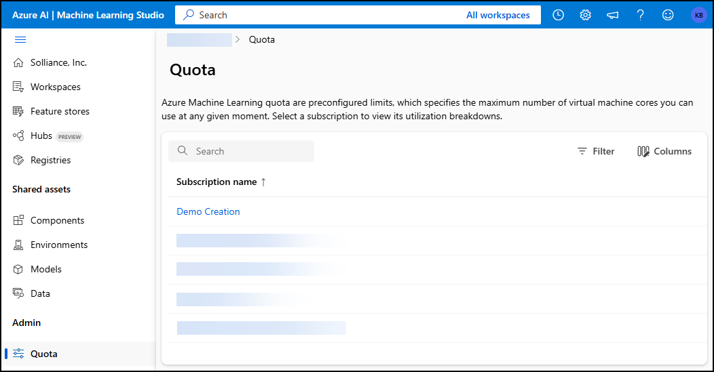

# 2.4 Azure クォータの確認

このソリューションには、Azure で必要なリソースをプロビジョニングし、スターターアプリを Azure Container Apps (ACA) にデプロイする Azure Developer CLI `azd-template` が含まれています。このテンプレートを使用すると、単一の `azd up` コマンドでインフラストラクチャをデプロイできます。

- [X] Azure ML CPU クォータを確認済み
- [X] Azure に認証済み
- [X] Azure リソースをプロビジョニングし、スターターソリューションをデプロイ済み

## Azure ML CPU クォータの確認

このソリューションアクセラレータには、PostgreSQL データベースから直接セマンティックランキングモデルを設定および使用するためのセクションが含まれています。このアーキテクチャのコンポーネントをデプロイするには、選択したモデルに応じて Azure Machine Learning に十分な CPU クォータ（4 または 16 コア）が必要です。

- [Hugging Face miniLM リランカーモデルのデプロイ](https://huggingface.co/cross-encoder/ms-marco-MiniLM-L6-v2)。小型モデル、高精度、4 CPU コアが必要。
- [Hugging Face BGE リランカーモデルのデプロイ](https://huggingface.co/BAAI/bge-reranker-v2-m3)。大型モデル、最高精度、16 CPU コアが必要。

このタスクでは、ターゲット仮想マシン (VM) インスタンスタイプ (`STANDARD_D4AS_V4` または `STANDARD_D16AS_V4`) の利用可能なクォータを確認し、ない場合は追加のクォータをリクエストする必要があります。

1. 利用可能なクォータを表示するには、まず [Azure ポータル](https://portal.azure.com/) から Microsoft Entra ID **テナント ID** を取得する必要があります。

2. Azure ポータルで、検索バーに「Microsoft Entra ID」と入力し、結果の **サービス** リストから **Microsoft Entra ID** を選択します。

    

3. Microsoft Entra ID テナントの **概要** ページで、**テナント ID** の **クリップボードにコピー** ボタンを選択します。

    

4. 新しいブラウザウィンドウまたはタブを開き、Azure ポータルの Entra ID 概要ページからコピーしたテナント ID で `<your-tenant-id>` トークンを置き換えて、次の URL に移動します。

    ```bash title="Azure ML Quota page" linenums="0"
    https://ml.azure.com/quota?tid=<your-tenant-id>
    ```

5. Azure ML の **Quota** ページで、このワークショップで使用するサブスクリプションを選択します。

    

6. 選択したサブスクリプションのクォータページで、このワークショップで使用する予定の Azure リージョンを選択します。これは、前のタスクで選択した、必要な Azure OpenAI モデルをサポートするリージョンである必要があります。

7. サブスクリプション内の CPU とそのクォータのリストが表示されます。リスト内の **Standard DASv4 Family Cluster Dedicated vCPUs** を見つけて、利用可能な **Quota** を確認します。

    

8. (ミニモデルの場合は 4 コア、bge モデルの場合は 16 コア) 以上が利用可能であれば、クォータの増加を要求する必要はありません。それ以外の場合は、名前の左側のボックスをチェックして **Standard DASv4 Family Cluster Dedicated vCPUs** を選択し、ページの上部にスクロールして **Request quota** ボタンを見つけます。

    

9. **Request quota** ダイアログで、**New cores limit** 値を (4 または 16) 増やし、**Submit** を選択します。

    

    !!! example "クォータ増加の例"

        新しいデプロイメントのために (4 または 16) コアが利用可能であることを確認するために、**new cores limit** を増やす必要があります。例えば、利用可能なコアがゼロの場合、新しいコア制限は (4 または 16) に設定する必要があります。コア制限が 100 で現在 90 を使用している場合、新しいコア制限は (94 または 106) に設定する必要があります。

10. クォータ増加のリクエストは通常数分で完了します。リクエストの処理中および完了時に、Azure ポータルで通知を受け取ります。

11. リクエストが拒否された場合、リクエストを発行する権限がない場合、または追加のクォータをリクエストしないことを選択した場合は、`azd up` コマンドを実行する際に `deployAMLModel` フラグを `none` に設定することで、**Semantic Ranking** モデルのデプロイを除外するオプションがあります。

## Azure リソースプロバイダーの確認 {/*examples*/}

ソリューションアクセラレータが Azure Machine Learning リソースを正常にデプロイするためには、いくつかの Azure リソースプロバイダーを Azure サブスクリプションに登録する必要があります。

必要な Azure リソースプロバイダーは以下の通りです：

- `Microsoft.Cdn`
- `Microsoft.PolicyInsights`
- `Microsoft.MachineLearningServices`
- `Microsoft.ApiManagement`

リソースプロバイダーが登録されているか確認し、登録されていない場合は登録する手順は以下の通りです：

1. 次のコマンドを実行して、Azure サブスクリプションにリソースプロバイダーが登録されているか確認します：

    ```azurecli
    az provider list --query "[?namespace=='Microsoft.Cdn' || namespace=='Microsoft.PolicyInsights' || namespace == 'Microsoft.MachineLearningServices' || namespace == 'Microsoft.ApiManagement'].{Namespace: namespace, RegistrationState: registrationState}" -o table
    ```

    または、**Azure ポータル**内の**サブスクリプション**に移動し、**設定**の下の**リソースプロバイダー**に移動することでも確認できます。これにより、サブスクリプションに登録されているリソースプロバイダーを表示し、登録することができます。

    コンソール出力は次のようになります：

    ```text
    Namespace                          RegistrationState    
    ---------------------------------  -------------------  
    Microsoft.MachineLearningServices  NotRegistered        
    Microsoft.Cdn                      Registered           
    Microsoft.PolicyInsights           NotRegistered        
    Microsoft.ApiManagement            NotRegistered        
    ```

    コンソール出力にはリソースプロバイダーと**RegistrationState**が表示されます。**RegistrationState**が**Registered**と表示されている場合、そのリソースプロバイダーは Azure サブスクリプションに登録されています。

2. Azure サブスクリプションにすべてのリソースプロバイダーを登録するには、次のコマンドを実行します：

```azurecli
az provider register --namespace Microsoft.MachineLearningServices
    az provider register --namespace Microsoft.Cdn
    az provider register --namespace Microsoft.PolicyInsights
    az provider register --namespace Microsoft.ApiManagement
```

1つ以上のリソースプロバイダーが既に登録されている場合、登録されていないリソースプロバイダーに対してのみコマンドを実行してください。
