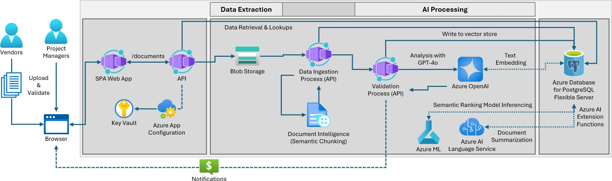
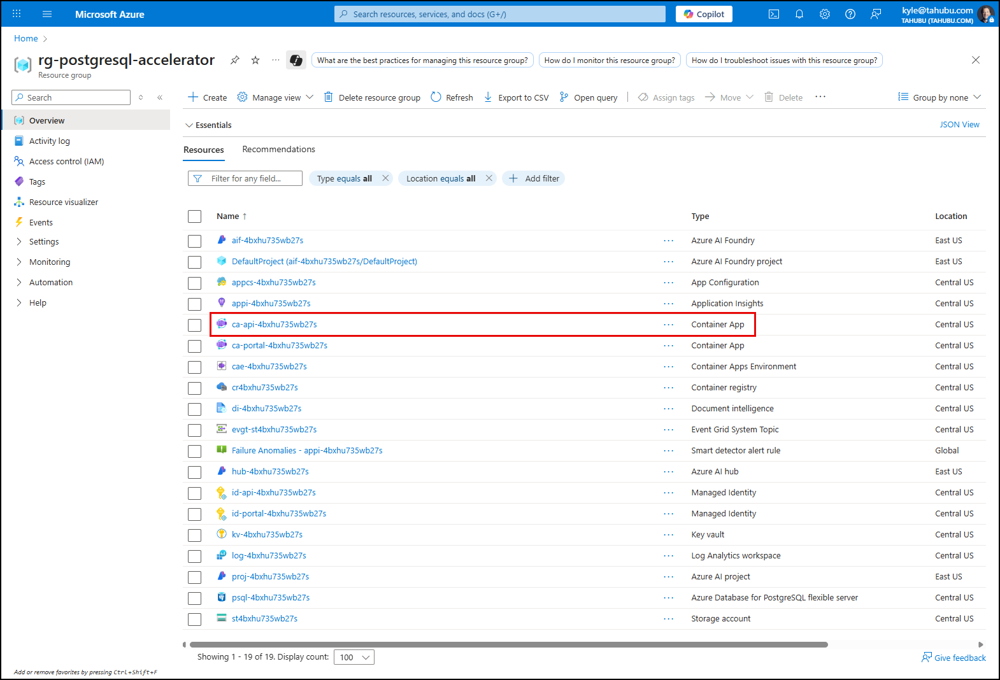
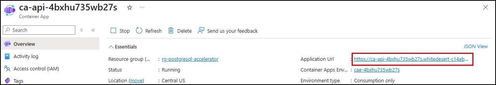
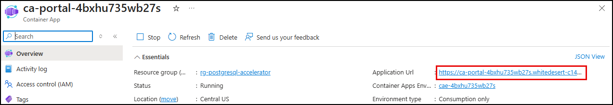
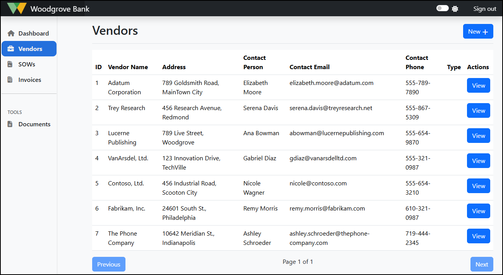
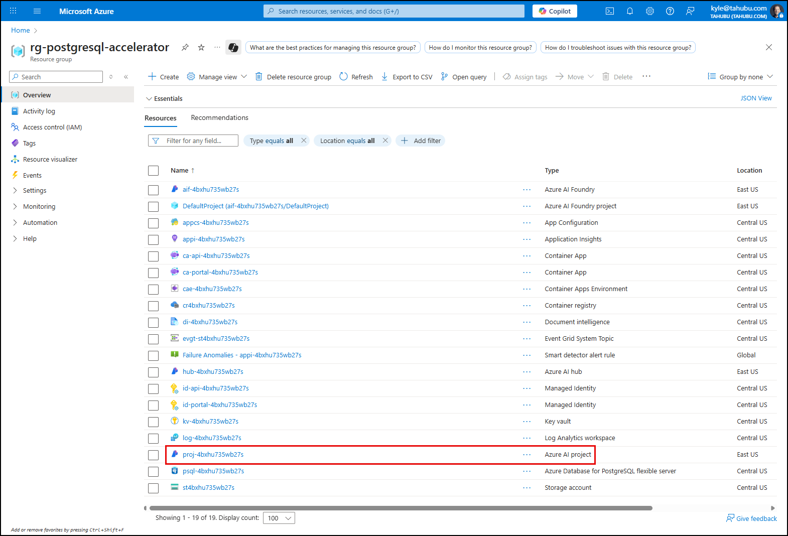
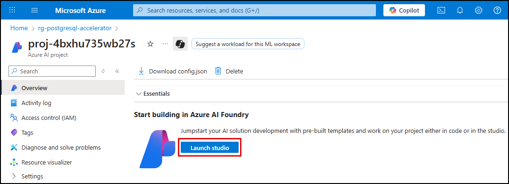
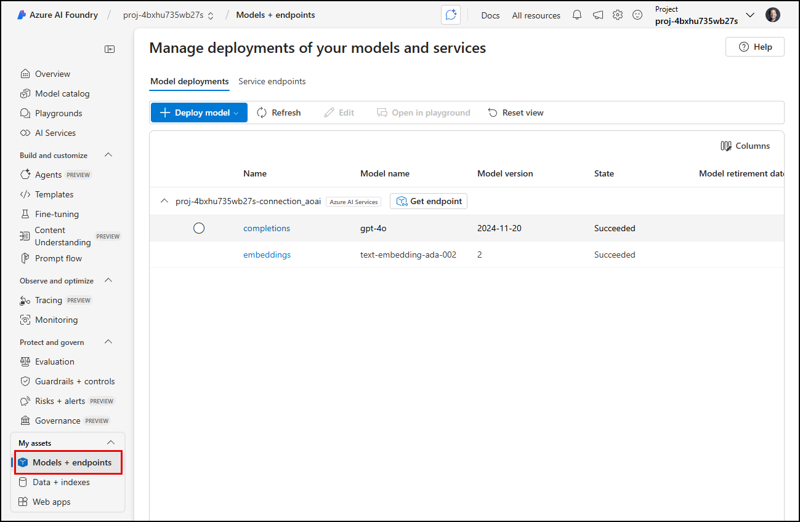

# 2.6 Validate Deployment

!!! success "SETUP IS COMPLETE!"

    You just completed the **PROVISION** and **SETUP** steps of workshop. 

    - [X] You installed the required tools and software
    - [X] You forked the sample repo and created a local clone
    - [X] You provisioned infrastructure resources on Azure
    - [X] You deployed the REACT UI and Python API to Azure Container Apps
    - [X] You configured your local development environment

Here's a reminder of the Azure Application Architecture you can reference as you check your provisioned Resource Group to enure these resources were created.



In this section, you will validate your setup before moving on to the next phase of solution development.

---

## Inspect deployed Azure resources

!!! tip "The Azure Portal allows you to view the resources provisioned on Azure and verify that they are setup correctly"

1. Open a new browser tab and navigate to the link below. You may be prompted to login.

    ```bash title="" linenums="0"
    https://portal.azure.com/#browse/resourcegroups
    ```

2. You may be presented with a "Welcome to Microsoft Azure" screen. Select **Cancel** (to dismiss it) or click **Get Started** (to take an introductory tour of the Azure Portal).

3. You should be taken directly to the Resource Groups page for your subscription. In the list of resource groups, locate the one named `rg-postgresql-accelerator` (or, if you assigned a different name, find that one). This resource group was created for you as part of the `azd up` resource deployment. It contains all of the Azure resources required to build and deploy your AI-enabled solution.

    !!! tip "You can use the search filter to reduce the number resource groups displayed."

4. Select your resource group.

    !!! note "Review the list of deployed resources."

        In addition to creating a resource group, the `azd up` command deployed multiple resources into that resource group, as shown in the table below.

        | Resource type | Name |
        | :-- | :-- |
        | Azure AI Foundry | `aif-<unique_string>` |
        | Azure AI Foundry project | `DefaultProject (aif-<unique_string>`)
        | Azure AI hub | `hub-<unique_string>` |
        | Azure AI project | `proj-<unique_string>` |
        | App Configuration | `appcs-<unique_string>` |
        | Application Insights | `appi-<unique_string>` |
        | Container App | `ca-api-<unique_string>` |
        | Container App | `ca-portal-<unique_string>` |
        | Container Apps Environment | `cae-<unique_string>` |
        | Container Registry | `cr<unique_string>` |
        | Document Intelligence | `di-<unique_string>` |
        | Event Grid System Topic | `evgt-<unique_string>` |
        | Key Vault | `kv-<unique_string>` |
        | Log Analytics workspace | `log-<unique_string>` |
        | Azure Database for PostgreSQL - Flexible Server | `psql-<unique_string>` |
        | Storage account | `st<unique_string>` |

        The `<unique_string>` token in the above resource names represents the unique string that is generated by the Bicep scripts when naming your resources. This ensures resources are uniquely named and avoid resource naming collisions.

        In addition to the above resources, you will also see several other resources, like _Managed Identities_, that are supporting resources for those in the table.

## Ensure the deployed apps are running

The `azd up` command included steps to deploy the Woodgrove Bank application into **Azure Container Apps** (ACA). Two containers were created. One for the Woodgrove Bank portal UI and a second for the backend API that supports it.

!!! info "Azure Container Apps (ACA) deployment"

    ACA is a fully managed serverless platform that allows you to deploy and manage containerized applications effortlessly. They simplify deployment, offer scalability and cost-effectiveness, and make it easier to focus on building applications without worrying about infrastructure management.

### Confirm the Woodgrove API Is Running

1. In the browser window opened to your Azure resource group, select the **Container app** resource whose name starts with **ca-api**.

    

2. In the **Essentials** section of the API Container App's **Overview** page, select the **Application Url** to open the deployed Woodgrove Bank API in a new browser tab.

    

3. You should see a `Welcome to the Woodgrove Bank API!` message on the screen, which serves as confirmation the API app was deployed successfully.

### Open the Woodgrove Portal UI

1. In the Azure portal, return to the resource group containing your resources and select the **Container app** resource whose name begins with **ca-portal**.

    

2. In the **Essentials** section of the Portal Container App's **Overview** page, select the **Application Url** to open the deployed Woodgrove Bank Portal in a new browser tab.

    

3. In the Woodgrove Bank Contract Management Portal, select the **Vendors** page and verify the list of vendors loads correctly.

    

## View Azure OpenAI model deployments in Azure AI Foundry

!!! tip "The Azure AI Foundry portal lets you view and manage the Azure AI models for your app."

You will use the Azure AI Foundry portal to verify the `gpt-4o` and `text-embedding-ada-002` models were deployed into your Azure OpenAI service.

1. In the Azure portal, return to the resource group containing your resources and select the **Azure AI project** resource. The name of the resource will start with `proj-`.

    

2. On the Azure AI project resource's **Overview** page, select **Launch studio** under the **Start building in Azure AI Foundry** heading.

    

3. In **Azure AI Foundry**, select the **Models + endpoints** item under **My assets** in the left-hand navigation menu.

    

4. Verify you see a `completions` deployment for the `gpt-4o` model and an `embeddings` deployment for the `text-embedding-ada-002` model.

!!! tip "Leave the Azure Portal open. You will revisit it later."
