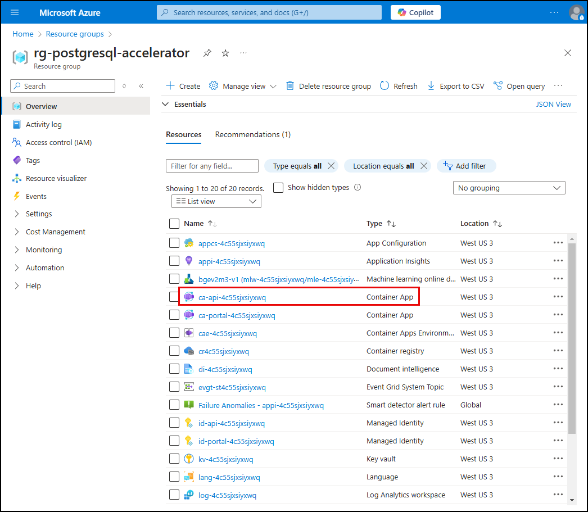
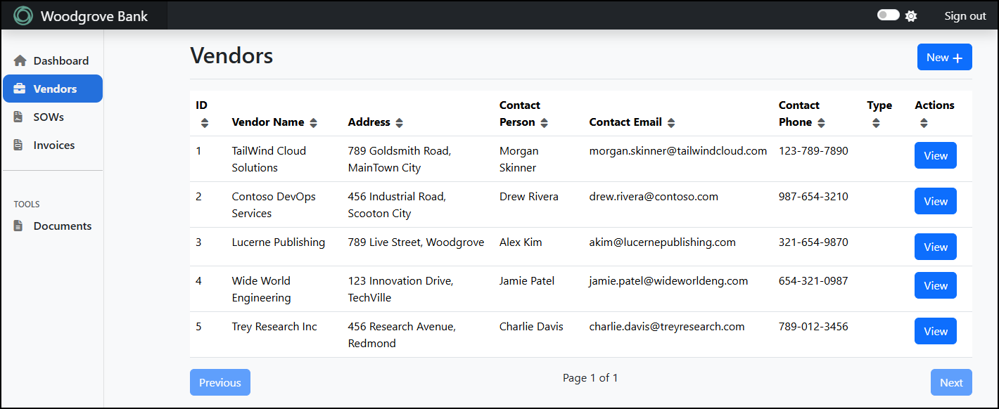
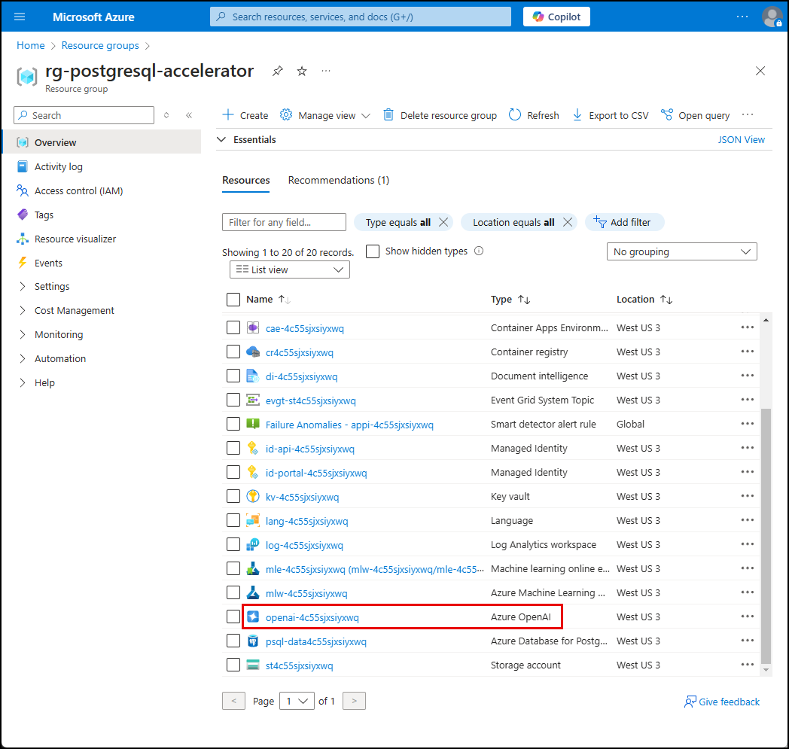
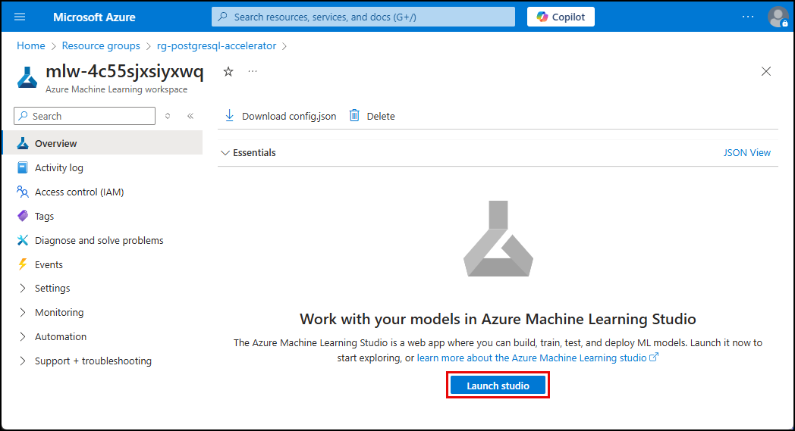

# 2.6 デプロイの検証 {/*examples*/}

!!! success "セットアップが完了しました！"

    ワークショップの**プロビジョン**と**セットアップ**のステップを完了しました。

    - [X] 必要なツールとソフトウェアをインストールしました
    - [X] サンプルリポジトリをフォークし、ローカルクローンを作成しました
    - [X] Azureでインフラストラクチャリソースをプロビジョニングしました
    - [X] REACT UIとPython APIをAzure Container Appsにデプロイしました
    - [X] ローカル開発環境を設定しました

プロビジョニングされたリソースグループを確認する際に参照できるAzureアプリケーションアーキテクチャのリマインダーです。


このセクションでは、次のソリューション開発フェーズに進む前にセットアップを検証します。

---

## デプロイされたAzureリソースの確認 {/*examples*/}

!!! tip "Azureポータルを使用すると、Azureにプロビジョニングされたリソースを表示し、正しく設定されているかを確認できます"

1. 新しいブラウザタブを開き、以下のリンクに移動します。ログインを求められる場合があります。

    ```bash title=""
    https://portal.azure.com/#browse/resourcegroups
    ```

2. "Microsoft Azureへようこそ"の画面が表示される場合があります。**キャンセル**を選択して画面を閉じるか、**はじめに**をクリックしてAzureポータルの紹介ツアーを受けることができます。

3. サブスクリプションのリソースグループページに直接移動します。リソースグループのリストで、`rg-postgresql-accelerator`という名前のものを見つけます（または、異なる名前を割り当てた場合はその名前を見つけます）。このリソースグループは、`azd up`リソースデプロイメントの一環として作成されました。AI対応ソリューションを構築およびデプロイするために必要なすべてのAzureリソースが含まれています。

    !!! tip "検索フィルターを使用して表示されるリソースグループの数を減らすことができます。"

4. リソースグループを選択します。

    !!! note "デプロイされたリソースのリストを確認します。"

        リソースグループの作成に加えて、`azd up`コマンドは以下の表に示すように、複数のリソースをそのリソースグループにデプロイしました。

```markdown
| リソースタイプ | 名前 |
| :-- | :-- |
| コンテナレジストリ | `cr<unique_string>` |
| Log Analytics ワークスペース | `log-<unique_string>` |
| Key Vault | `kv-<unique_string>` |
| ドキュメントインテリジェンス | `di-<unique_string>` |
| 言語 | `lang-<unique_string>` |
| Application Insights | `appi-<unique_string>` |
| コンテナアプリ環境 | `cae-<unique_string>` |
| ストレージアカウント | `st<unique_string>` |
| Azure Database for PostgreSQL - フレキシブルサーバー | `psql-data<unique_string>` |
| Azure OpenAI | `openai-<unique_string>` |
| 機械学習ワークスペース | `mlw-<unique_string>` |
| 機械学習エンドポイント | `mle-<unique_string>` |
| コンテナアプリ | `ca-api-<unique_string>` |
| コンテナアプリ | `ca-portal-<unique_string>` |

上記のリソース名にある `<unique_string>` トークンは、リソースの命名時に Bicep スクリプトによって生成されるユニークな文字列を表しています。これにより、リソースがユニークに命名され、リソース命名の衝突を避けることができます。

上記のリソースに加えて、_Managed Identities_ のような、表にあるリソースをサポートするいくつかの他のリソースも表示されます。

## デプロイされたアプリが実行されていることを確認する {/*examples*/}

`azd up` コマンドには、Woodgrove Bank アプリケーションを **Azure Container Apps** (ACA) にデプロイする手順が含まれています。2つのコンテナが作成されました。1つは Woodgrove Bank ポータル UI 用で、もう1つはそれをサポートするバックエンド API 用です。

!!! info "Azure Container Apps (ACA) のデプロイ"

    ACA は、コンテナ化されたアプリケーションを簡単にデプロイおよび管理できる完全に管理されたサーバーレスプラットフォームです。デプロイを簡素化し、スケーラビリティとコスト効率を提供し、インフラストラクチャ管理を気にせずにアプリケーションの構築に集中することができます。

### Woodgrove API が実行されていることを確認する {/*examples*/}

1. Azure リソースグループに開かれたブラウザウィンドウで、名前が **ca-api** で始まる **コンテナアプリ** リソースを選択します。
```


    

2. API コンテナーアプリの **概要** ページの **基本情報** セクションで、**アプリケーション URL** を選択し、デプロイされた Woodgrove Bank API を新しいブラウザタブで開きます。

    

3. 画面に `Welcome to the Woodgrove Bank API!` というメッセージが表示されるはずです。これは、API アプリが正常にデプロイされたことを確認するものです。

### Woodgrove ポータル UI を開く

1. Azure ポータルで、リソースを含むリソースグループに戻り、名前が **ca-portal** で始まる **コンテナーアプリ** リソースを選択します。

    

2. ポータルコンテナーアプリの **概要** ページの **基本情報** セクションで、**アプリケーション URL** を選択し、デプロイされた Woodgrove Bank ポータルを新しいブラウザタブで開きます。

    

3. Woodgrove Bank 契約管理ポータルで、**ベンダー** ページを選択し、ベンダーのリストが正しく読み込まれることを確認します。

    

## Azure AI Foundry で Azure OpenAI モデルのデプロイを表示する

!!! tip "Azure AI Foundry ポータルを使用すると、アプリの Azure AI リソースを表示および管理できます。"

Azure AI Foundry ポータルを使用して、`gpt-4o` および `text-embedding-ada-002` モデルが Azure OpenAI サービスにデプロイされたことを確認します。

1. Azure ポータルで、リソースを含むリソースグループに戻り、**Azure OpenAI** リソースを選択します。

    

2. Azure OpenAI リソースの **概要** ページで、**Azure AI Foundry ポータルを探索** を選択します。

    

3. **Azure AI Foundry** で、左側のナビゲーションメニューの **共有リソース** の下にある **デプロイメント** メニュー項目を選択します。

    

4. `gpt-4o` モデルの `completions` デプロイメントと `text-embedding-ada-002` モデルの `embeddings` デプロイメントが表示されていることを確認します。

## セマンティックランカーモデルのデプロイメントを確認する（オプション）

セットアップ中に Azure ML セマンティックランカーモデルをデプロイすることを選択した場合、Azure Machine Learning Studio を使用して、セマンティックランカーモデルがオンラインエンドポイントに正常にデプロイされたことを確認します。

!!! warning "このステップは、`azd up` デプロイメント中に `deployAMLModel` に `mini` または `bge` を選択した場合にのみ必要です。`none` を選択した場合は、このステップをスキップしてください。"

1. Azure ポータルで、リソースを含むリソースグループに戻り、**Azure Machine Learning ワークスペース** リソースを選択します。

    

2. Azure ML ワークスペースページから、**スタジオを起動** ボタンを選択して、新しいブラウザウィンドウで Azure Machine Learning Studio を開きます。

    

3. プロンプトが表示されたら、Machine Learning Studio にサインインします。

4. Machine Learning Studio で、左側のリソースメニューの **アセット** の下にある **エンドポイント** を選択し、次にあなたのエンドポイント（`bge-v2-m3-reranker model` または `msmarco-minilm-deployment-6 model`）を選択します。


    

5. エンドポイントページで、(_bgev2m3-v1_ または _msmarco-minilm-deployment-6_) デプロイメントの **Provisioning state** が **Succeeded** であることを確認します。

    

!!! tip "Azure Portalを開いたままにしておいてください。後で再訪します。"
