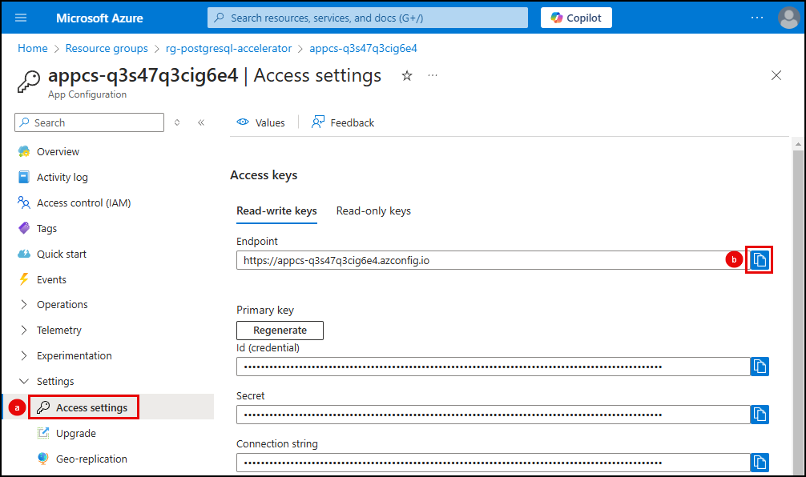
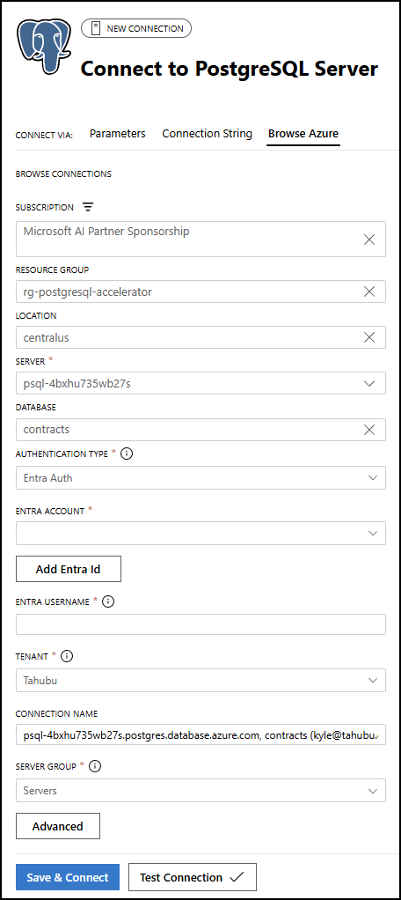

# 2.7 Setup Dev Environment

In this step, you will configure your Python development environment in Visual Studio Code. At the end of this step, you should have:

- [X] Created a Python virtual environment
- [X] Installed the required Python libraries from `requirements.txt`
- [X] Create and populated a `.env` file in the **Woodgrove API** project.
- [X] Connected to your database using the PostgreSQL extension in VS Code.

## Create a Python virtual environment

Virtual environments in Python are essential for maintaining a clean and organized development space, allowing individual projects to have their own set of dependencies, isolated from others. This prevents conflicts between different projects and ensures consistency in your development workflow. By using virtual environments, you can manage package versions easily, avoid dependency clashes, and keep your projects running smoothly. It's a best practice that keeps your coding environment stable and dependable, making your development process more efficient and less prone to issues.

1. Return to Visual Studio Code, where you have the **PostgreSQL Solution Accelerator: Build your own AI Copilot** project open.

2. In Visual Studio Code, open a new terminal window and change directories to the `src/api` folder of the repo, and create a virtual environment named `.venv` by running the following command at the terminal prompt:

    ```bash title="" linenums="0"
    cd src/api
    python -m venv .venv 
    ```

    The above command will create a `.venv` folder under the `api` folder, which will provide a dedicated Python environment for the `api` project that can be used throughout this lab.

3. Activate the virtual environment.

    !!! note "Select the appropriate command for your OS and shell from the table."

        | Platform | Shell | Command to activate virtual environment |
        | -------- | ----- | --------------------------------------- |
        | POSIX | bash/zsh | `source .venv/bin/activate` |
        | | fish | `source .venv/bin/activate.fish` |
        | | csh/tcsh | `source .venv/bin/activate.csh` |
        | | pwsh | `.venv/bin/Activate.ps1` |
        | Windows | cmd.exe | `.venv\Scripts\activate.bat` |
        | | PowerShell | `.venv\Scripts\Activate.ps1` |
        | macOS | bash/zsh | `source .venv/bin/activate` |

4. Execute the command at the terminal prompt to activate your virtual environment.

## Install required Python libraries

The `requirements.txt` file in the `src\api` folder contains the set of Python libraries needed to run the Python components of the solution accelerator.

!!! tip "Review required libraries"

    Open the `src\api\requirements.txt` file in the repo to review the required libraries and the versions that are being used.

1. From the integrated terminal window in VS Code, run the following command to install the required libraries in your virtual environment:

    ```bash title="" linenums="0"
    pip install -r requirements.txt
    ```

## Create `.env` file

Configuration values, such as connection string and endpoints, that allow your application to interact with Azure services are hosted in an Azure App Configuration service. To enable your application to retrieve these values, you must provide it with the endpoint of that service. You will use a `.env` file to host the endpoint as an environment variable, which will allow you to run the Woodgrove API locally. The `.env` file will be created within the `src\api\app` folder of the project.

1. In VS Code, navigate to the `src\api\app` folder in the **Explorer** panel.

2. Right-click the `app` folder and select **New file...** from the context menu.

3. Enter `.env` as the name of the new file within the VS Code **Explorer** panel.

4. In the `.env` file, add the following as the first line, replacing the `{YOUR_APP_CONFIG_ENDPOINT}` with the endpoint for the App Configuration resource in your deployed resource group.

    ```ini title="" linenums="0"
    AZURE_APP_CONFIG_ENDPOINT={YOUR_APP_CONFIG_ENDPOINT}
    ```

    !!! note "Retrieve the endpoint for your App Configuration resource"

        To get the endpoint for your App Configuration resource:

        1. Navigate to your App Configuration resource in the [Azure portal](https://portal.azure.com/).
        
        2. Select **Access settings** from the resource navigation menu, under **Settings**.
        
        3. Copy the **Endpoint** value and paste it into the `.env` file.

            

5. Save the `.env` file.

## Connect to your database

You will use the [PostgreSQL extension in VS Code](https://learn.microsoft.com/azure/postgresql/extensions/vs-code-extension/overview) to connect to your database, configure various features in the database, and execute queries to test those features. The `azd up` deployment script added your Microsoft Entra ID user as the owner of the database, so you will authenticate with Entra ID. Please follow the steps below to connect to your Azure Database for PostgreSQL - Flexible Server using the PostgreSQL extension in VS Code:

1. In Visual Studio Code, open the **PostgreSQL** extension by selecting the PostgreSQL (elephant) icon in the _Activity Bar_ or by using the `View: Show PostgreSQL` command.

2. Select **Add Connection** in the PostgreSQL panel.

3. Select the **Browse Azure** tab in the **Connect to PostgreSQL Server** dialog.

4. On the **Browse Azure** tab:

   - Select your subscription, resource group, location, and PostgreSQL server. After selecting your PostgreSQL server, more options will appear.
   - For **Database**, select the `contracts` database from the drop down list.
   - Under **Authentication Type**, select **Entra Auth**. Choose your **Entra Account** and select **Add Entra Id**. Log into your Azure account in the browser windows the opens.
   - Select **Test Connection** to ensure you are able to connect to the database.
   - Select **Save & Connect**.

    

!!! tip "Leave VS Code open as you will be using it throughout the remainder of the workshop."
