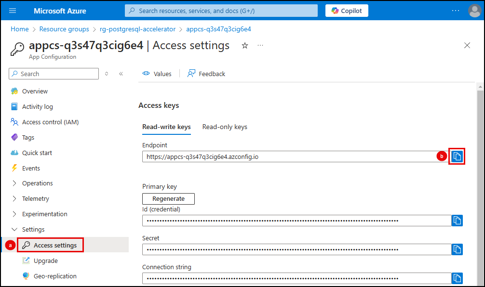
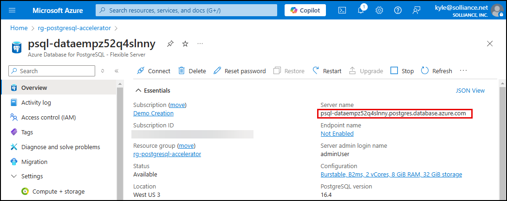
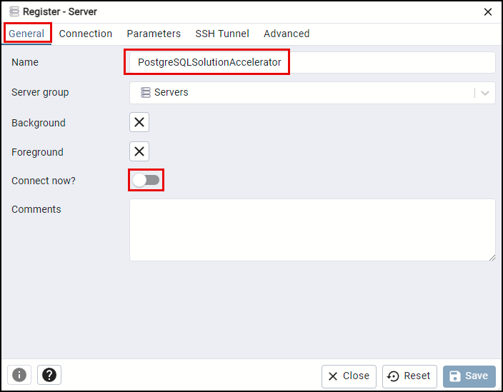
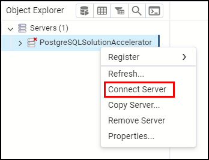

# 2.7 開発環境のセットアップ

このステップでは、Visual Studio Code で Python 開発環境を設定します。このステップの終わりには、以下が完了しているはずです。

- [X] Python 仮想環境を作成した
- [X] `requirements.txt` から必要な Python ライブラリをインストールした
- [X] **Woodgrove API** プロジェクトに `.env` ファイルを作成し、内容を入力した
- [X] pgAdmin を使用してデータベースに接続した

## Python 仮想環境を作成する

Python の仮想環境は、クリーンで整理された開発スペースを維持するために不可欠であり、個々のプロジェクトが他のプロジェクトから独立した依存関係のセットを持つことを可能にします。これにより、異なるプロジェクト間の競合を防ぎ、開発ワークフローの一貫性を確保します。仮想環境を使用することで、パッケージのバージョンを簡単に管理し、依存関係の衝突を避け、プロジェクトをスムーズに実行できます。これは、コーディング環境を安定して信頼できるものに保ち、開発プロセスをより効率的で問題が少ないものにするベストプラクティスです。

1. **PostgreSQL Solution Accelerator: Build your own AI Copilot** プロジェクトを開いている Visual Studio Code に戻ります。

2. Visual Studio Code で新しいターミナルウィンドウを開き、リポジトリの `src/api` フォルダーにディレクトリを変更し、次のコマンドをターミナルプロンプトで実行して `.venv` という名前の仮想環境を作成します。

    ```bash title=""
    cd src/api
    python -m venv .venv 
    ```

    上記のコマンドは、`api` フォルダーの下に `.venv` フォルダーを作成し、このラボ全体で使用できる `api` プロジェクト専用の Python 環境を提供します。

3. 仮想環境をアクティブにします。

    !!! note "OS とシェルに応じて適切なコマンドを選択してください。"

        | プラットフォーム | シェル | 仮想環境をアクティブにするコマンド |
        | -------- | ----- | --------------------------------------- |
        | POSIX | bash/zsh | `source .venv/bin/activate` |
        | | fish | `source .venv/bin/activate.fish` |
        | | csh/tcsh | `source .venv/bin/activate.csh` |
        | | pwsh | `.venv/bin/Activate.ps1` |
        | Windows | cmd.exe | `.venv\Scripts\activate.bat` |
        | | PowerShell | `.venv\Scripts\Activate.ps1` |
        | macOS | bash/zsh | `source .venv/bin/activate` |

4. ターミナルプロンプトでコマンドを実行して、仮想環境をアクティブにします。

## 必要なPythonライブラリのインストール

`src\api`フォルダー内の`requirements.txt`ファイルには、ソリューションアクセラレーターのPythonコンポーネントを実行するために必要なPythonライブラリのセットが含まれています。

!!! tip "必要なライブラリを確認"

    リポジトリ内の`src\api\requirements.txt`ファイルを開いて、使用されている必要なライブラリとバージョンを確認してください。

1. VS Codeの統合ターミナルウィンドウから、次のコマンドを実行して仮想環境に必要なライブラリをインストールします。

    ```bash title=""
    pip install -r requirements.txt
    ```

## `.env`ファイルの作成

接続文字列やエンドポイントなどの構成値は、Azureサービスとアプリケーションが連携するために必要で、Azure App Configurationサービスにホストされています。これらの値をアプリケーションが取得できるようにするために、そのサービスのエンドポイントを提供する必要があります。エンドポイントを環境変数としてホストするために、`.env`ファイルを使用します。これにより、Woodgrove APIをローカルで実行できるようになります。`.env`ファイルはプロジェクトの`src\api\app`フォルダー内に作成されます。

1. VS Codeで、**Explorer**パネル内の`src\api\app`フォルダーに移動します。

2. `app`フォルダーを右クリックし、コンテキストメニューから**New file...**を選択します。

3. VS Codeの**Explorer**パネル内で、新しいファイルの名前として`.env`を入力します。

4. `.env`ファイルに、次の内容を最初の行として追加し、`{YOUR_APP_CONFIG_ENDPOINT}`をデプロイされたリソースグループ内のApp Configurationリソースのエンドポイントに置き換えます。

    ```ini title=""
    AZURE_APP_CONFIG_ENDPOINT={YOUR_APP_CONFIG_ENDPOINT}
    ```

    !!! note "App Configurationリソースのエンドポイントを取得"

        App Configurationリソースのエンドポイントを取得するには:

        1. [Azureポータル](https://portal.azure.com/)でApp Configurationリソースに移動します。
        
        2. リソースナビゲーションメニューの**Settings**の下にある**Access settings**を選択します。
        
        3. **Endpoint**の値をコピーして、`.env`ファイルに貼り付けます。


            

5. `.env` ファイルを保存します。

## pgAdmin からデータベースに接続する {/*examples*/}

pgAdmin を使用して、データベース内のさまざまな機能を構成し、それらの機能をテストするためのクエリを実行します。`azd up` デプロイメント スクリプトは、Microsoft Entra ID ユーザーをデータベースの所有者として追加したため、Entra ID で認証します。pgAdmin を使用して Azure Database for PostgreSQL - Flexible Server に接続するには、以下の手順に従ってください。

1. [Azure portal](https://portal.azure.com/) で Azure Database for PostgreSQL - Flexible Server リソースに移動します。

2. Azure Database for PostgreSQL - Flexible Server ページで、**概要** ページの **基本** パネルから **サーバー名** の値をコピーします。値の右側にある _クリップボードにコピー_ ボタンを選択します。

    

3. 開発用コンピューターで pgAdmin を開きます。

4. pgAdmin の **オブジェクト エクスプローラー** で、**サーバー** を右クリックし、コンテキスト メニューで **登録 >** を選択し、次に **サーバー...** を選択します。

    

5. **サーバーの登録** ダイアログのタブで、次の手順に従います。

    1. **一般** タブで、**名前** フィールドに「PostgreSQLSolutionAccelerator」と入力し、**今すぐ接続** オプションをクリアします。

        

    2. **接続** タブを選択し、**ホスト名/アドレス** と **ユーザー名** に Azure Database for PostgreSQL フレキシブル サーバー インスタンスの詳細を入力します。

        1. Azure Database for PostgreSQL フレキシブル サーバーの **サーバー名** の値を **ホスト名/アドレス** フィールドに貼り付けます。

2. **ユーザー名**の値は、Microsoft Entra IDまたはメールアドレスです。

3. **保存**を選択します。

4. pgAdmin Object Explorerで新しく追加された**PostgreSQLSolutionAccelerator**サーバーを右クリックし、コンテキストメニューから**サーバーに接続**を選択します。

   

5. **サーバーに接続**ダイアログで、アクセストークンを提供する必要があります。

   !!! note "Microsoft Entra IDアクセストークンの取得方法"

       1. VS Codeで、新しい統合ターミナルを開きます。

       2. 統合ターミナルのプロンプトで、次のコマンドを実行してアクセストークンを生成し、出力します：

           ```bash
           $token = az account get-access-token --resource-type oss-rdbms --output json | ConvertFrom-Json
           $token.accessToken
           ```

       3. 出力された値をコピーします。

           !!! info "トークンはBase64文字列です。認証されたユーザーに関するすべての情報をエンコードしており、Azure Database for PostgreSQLサービスを対象としています。"

6. pgAdminに戻り、**サーバーに接続**ダイアログでアクセストークンをパスワードフィールドに貼り付けます。

   

   !!! note "パスワードを保存しないでください！"

       _サーバーに接続_ダイアログの**パスワードを保存**ボックスがチェックされていないことを確認してください。このボックスをチェックすると、ログインに失敗する可能性があります。

7. **OK**を選択します。

   !!! warning "アクセストークンの有効期限切れ"

       ワークショップ中にアクセストークンの有効期限が切れた場合、再認証するために上記の手順を繰り返す必要があります。

!!! tip "ワークショップの残りの部分で使用するため、pgAdminを開いたままにしておいてください。"
