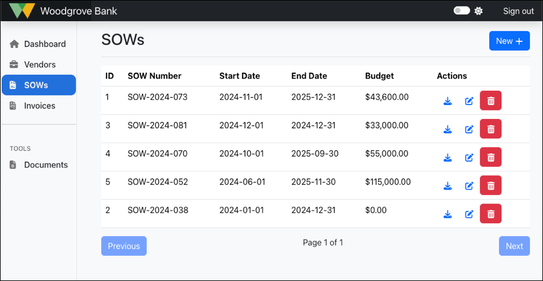
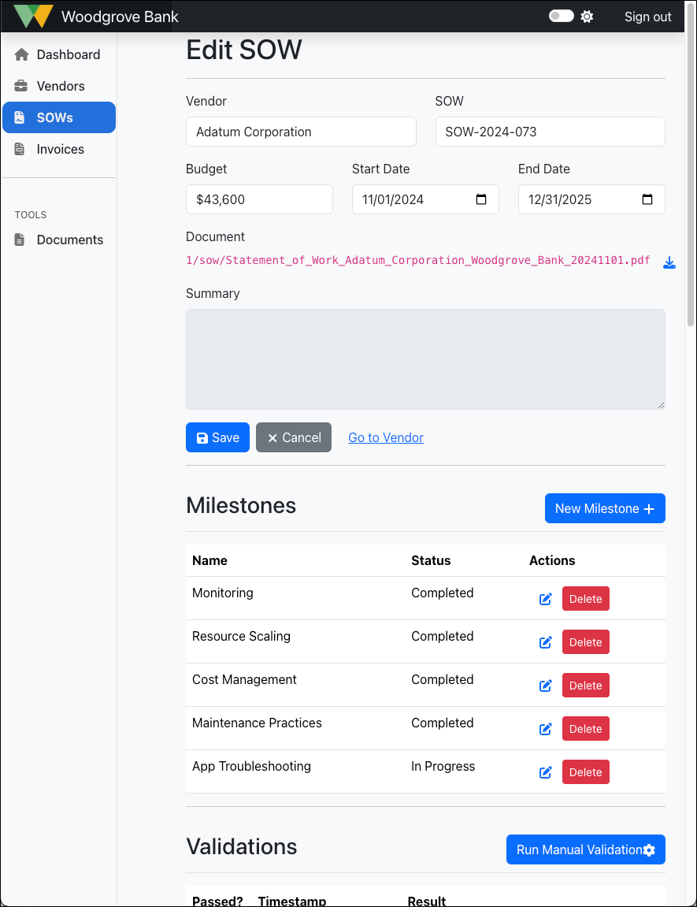
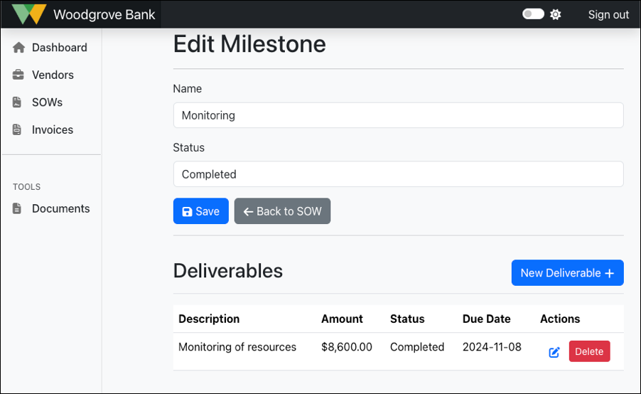
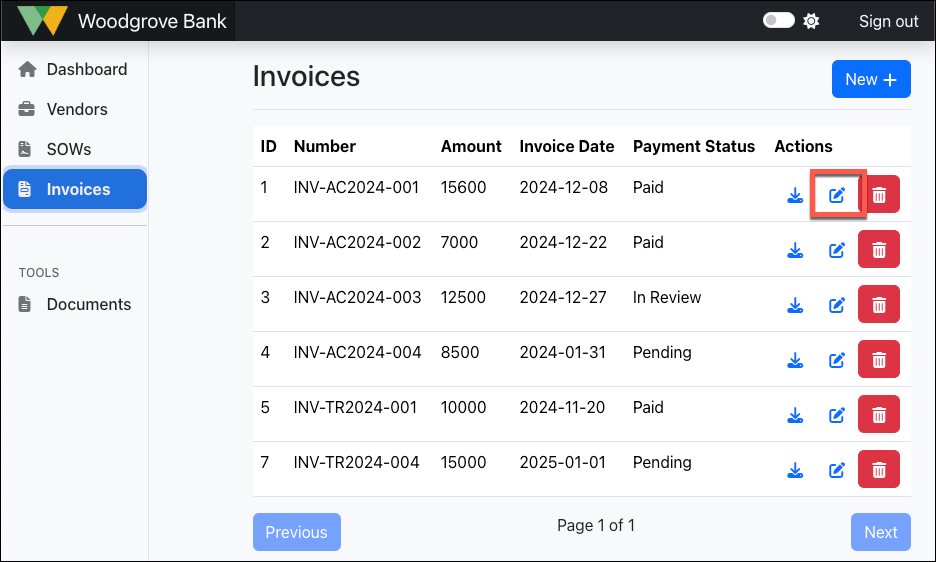

# 2.8 手動プロセスのレビュー

_Woodgrove Bank Contract Management_ アプリケーションにAI機能を統合するプロセスを開始する前に、現在彼らがシステムにデータを入力するために使用している手動プロセスを確認しましょう。ユーザーはまずSOWと請求書のドキュメントを読み、正しい情報をアプリケーションのフィールドにコピー＆ペーストする必要があります。この手動プロセスは非常に時間がかかり、エラーが発生しやすいです。

## SOWのレビュー

SOWのアプリケーションUIを確認しましょう。

1. Woodgrove Bank Contract Management Portalで、**SOWs** ページを選択し、SOWのリストを表示します。

    

2. **SOW-2024-073** SOWを見つけ、**Actions** 列の下にある **Edit** ボタンを選択します。これにより、SOWの編集ページが開きます。

    

3. SOW編集ページで、**Statement of Work** の主要なフィールド（ベンダー、SOW名、予算、開始日、終了日）を入力する必要があることに注意してください。また、アップロードされたSOWドキュメントに基づいて手動で入力する必要があるマイルストーンのリストにも注意してください。

    

4. **Monitoring** マイルストーンの **Edit** ボタンを選択します。これにより、マイルストーンの必須フィールドと、アップロードされたSOWドキュメントに基づいて手動で入力する必要がある成果物を確認できる **Edit Milestone** ページが開きます。フィールドと成果物を確認した後、**Back to SOW** ボタンを選択します。

    

5. **Edit SOW** ページで、**Validations** 履歴リストに注意してください。これらのバリデーションは、SOWが更新されるたびに手動で入力されています。

    

6. **有効性**の下に、**SOWチャンク**のリストが表示されます。これらはSOWドキュメントのさまざまなセクションからのタイトルとコンテンツです。手動のワークフローでは、これらはSOWドキュメントからテキストを抽出するためにアプリケーションに手動でコピー＆ペーストされました。これは、ユーザーがSOWドキュメントを読みながらレビューする際に入力されます。

    

## 請求書のレビュー

請求書のアプリケーションUIをレビューしましょう。

1. Woodgrove Bank契約管理ポータルで、**請求書**ページを選択して請求書のリストを表示します。次に、リストの最初の請求書の**編集**ボタンを選択します。これにより、請求書編集ページが表示されます。

    

2. **請求書編集**ページで、アップロードされた請求書ドキュメントに手動で入力する必要があるさまざまなデータセクションを確認します：

    - **請求書**フィールド（ベンダー、SOW名、請求書番号、金額、請求日、支払い状況）
    - **ラインアイテム**は請求書ドキュメントから抽出し、手動で入力する必要があります。
    - **有効性**は、アップロードされた請求書ドキュメントを手動でレビューする際にユーザーが手動で入力します。

    

3. **有効性**内で、手動で入力された**結果**が一般的に非常に短く、あまり多くの情報を含んでいないことに注意してください。

    

    アプリケーションにAIを統合する際に気づくことの一つは、後のセクションでAIによって生成される有効性の要約がはるかに情報豊富になることです。

!!! success "おめでとうございます！旧ワークフローで手動入力されるSOWおよび請求書のデータフィールドを確認しました。次のユニットでは、AIを活用したワークフローの統合に取り組みます！"
