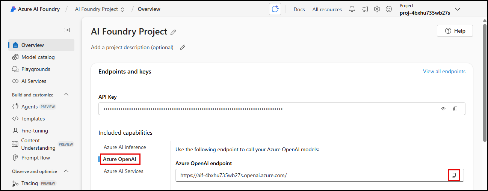
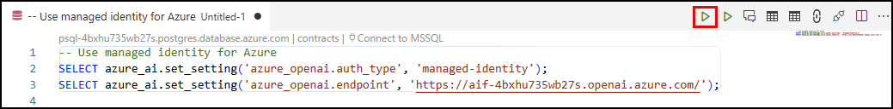
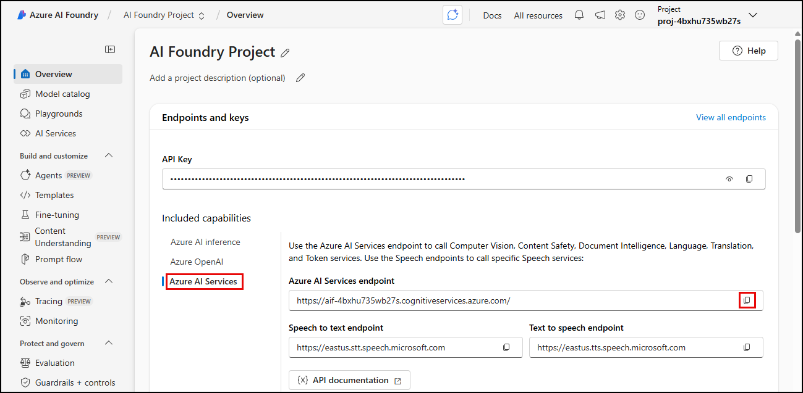

# 3.2 Configure the Azure AI extension

The `azure_ai` extension lets you directly integrate Azure AI Foundry services into your database. To start using the extension's capabilities, you must first configure its connection to your Azure AI Foundry services, providing each service's endpoint. System Assigned Managed Identities (SAMIs) where configured when the `azd up` command was executed to allow your database to securely access Azure AI Foundry services and models, so you will also configure the authentication type to use those managed identities.

!!! tip "Managed Identities offer enhanced security benefits"

    The Azure AI extension for supports System Assigned Managed Identity (SAMI) with Azure AI Services, Azure OpenAI, and Azure Machine Learning, offering enhanced security benefits. By using Microsoft Entra ID, users can authenticate without access keys, reducing the risk of unauthorized access and simplifying credential management. This integration ensures that identities and permissions are handled securely and efficiently, providing a robust framework for database security.

## Execute SQL in the PostgreSQL extension in VS Code to configure the extension

You will use **PostgreSQL in VS Code** to configure the `azure_ai` extension by executing SQL commands against your database.

1. Return to the open instance of **VS Code**, select the PostgreSQL extension icon (elephant) from the _Activity Bar_, and ensure it is connected to your PostgreSQL database.

2. In the PostgreSQL **Connections** dialog, expand **Databases** under your PostgreSQL server.

3. Right-click the **contracts** database and select **New Query** from the context menu.

4. Select each of the tabs below and execute the SQL commands.

!!! danger "Select each tab below and execute SQL statements provided to connect to each Azure AI service."

=== "Azure OpenAI in Azure AI Foundry"

    The Azure AI extension includes the `azure_openai` schema, which allows you to integrate the creation of vector representations of text values directly into your database by invoking [Azure OpenAI embeddings](https://learn.microsoft.com/azure/ai-services/openai/reference#embeddings). The vector embeddings can then be used in vector similarity searches.

    1. In the PostgreSQL in VS Code query window, paste the following SQL commands to configure the extension's connection to Azure OpenAI using the `set_setting()` function. Do not run the commands yet, as you first need to retrieve the endpoint for your Azure OpenAI in Azure AI Foundry service.

        ```sql title="" linenums="0"
        -- Use managed identity for Azure 
        SELECT azure_ai.set_setting('azure_openai.auth_type', 'managed-identity');
        -- Add the Azure OpenAI endpoint
        SELECT azure_ai.set_setting('azure_openai.endpoint', '<endpoint>');
        ```

    2. In a browser window, navigate to your Azure AI project (the resource name starts with `proj-`) in the [Azure portal](https://portal.azure.com/).

    3. On the Azure AI project's Overview page, select **Launch studio** to open the AI project in the Azure AI Foundry portal.

    4. On the **AI Foundry Project** Overview page, select **Azure OpenAI** under **Endpoints and keys** and copy the **Azure OpenAI endpoint**.
 
         

    5. In the PostgreSQL query window in VS Code, execute the updated SQL commands by selecting the **Execute PostgreSQL Query** button.

        

    6. The `azure_ai` extension also provides the `get_setting()` function, allowing users with appropriate permissions to view the values stored within each schema's settings. Run the following queries to view the Azure OpenAI endpoint and authentication type values stored in the database.

        ```sql title="" linenums="0"
        SELECT azure_ai.get_setting('azure_openai.endpoint');
        ```
    
        ```sql title="" linenums="0"
        SELECT azure_ai.get_setting('azure_openai.auth_type');
        ```

=== "Azure AI Services"

    The Azure AI services integrations included in the `azure_cognitive` schema of the `azure_ai` extension provide a rich set of AI Language features accessible directly from the database.
    
    1. In the PostgreSQL in VS Code query window, overwrite the previous commands by pasting the following SQL commands to configure the extension's connection to your Azure AI Services resource. Do not run the commands yet, as you first need to retrieve your service's endpoint.

        ```sql title="" linenums="0"
        -- Use managed identity for Azure 
        SELECT azure_ai.set_setting('azure_cognitive.auth_type', 'managed-identity');
        -- Add the Azure AI Services endpoint
        SELECT azure_ai.set_setting('azure_cognitive.endpoint', '<endpoint>');
        ```

    2. Return to the Azure AI Foundry Project page you opened in a web browser the previous task.

    3. On the **AI Foundry Project** Overview page, select **Azure AI Services** under **Endpoints and keys** and copy the **Azure AI Services endpoint**.
 
         

    4. In the PostgreSQL query window in VS Code, execute the updated SQL commands by selecting the **Execute PostgreSQL Query** button.

!!! danger "Be sure to run the scripts to add the endpoints and set the `auth_type` for both services (Azure OpenAI and Azure AI Services) in the database."
