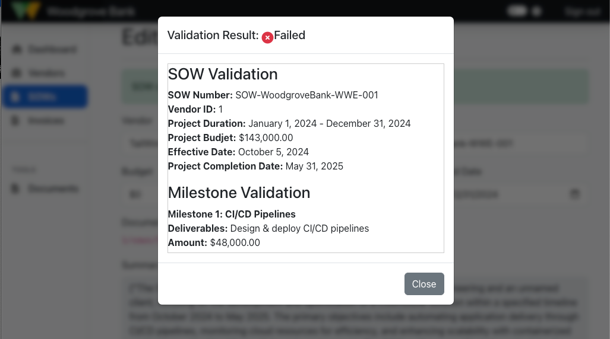
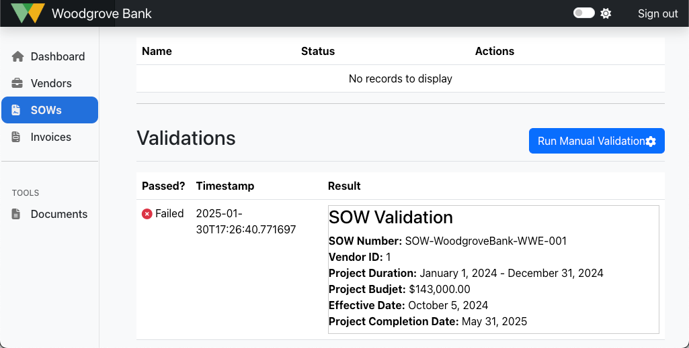

# 4.4 Azure OpenAIを使用したデータの検証

SOWおよび請求書の記録のためのアプリケーション内のドキュメント取り込みパイプラインは、マルチステージのワークフローで実装されています。ワークフローの最初のステージは、ドキュメントを分析し、アップロードされたドキュメントに基づいてSOWおよび請求書の記録をINSERT/UPDATEするためにシステムに取り込むことです。ワークフローの第二ステージは、SOWおよび/または請求書の記録を検証することです。

ドキュメント取り込みワークフローのSOWおよび請求書の検証ステップでは、Azure OpenAIを使用して、データベースからのデータを検証し、検証結果の分析を生成するために、取得拡張生成（RAG）パターンを使用したチャット補完を行います。

ワークフロープロセスの検証ステップのコードは、請求書の場合はREST API `/validation/invoice/{id}` エンドポイント、SOWの場合は `/validation/sow/{id}` エンドポイントに含まれています。これらのコードは `src/api/app/routers/validation.py` ファイル内にあります。以下の説明は請求書の検証プロセスをカバーしていますが、SOWについても同じ戦略が採用されています。

---

## Azure OpenAIを使用した検証の利点

検証ワークフローへのAzure OpenAIの統合は、いくつかの重要な利点を提供します：

- **自動化された検証:** 手動のデータレビューの必要性を減らし、時間と労力を節約します。

- **正確性とコンプライアンス:** 請求書がSOWの契約条件に一致することを保証し、支払いエラーを減少させます。

- **不正検出:** 支払いが処理される前に、潜在的な請求書詐欺や不整合を特定するのに役立ちます。

- **スケーラビリティ:** 大量の請求書を効率的に処理でき、広範なベンダー関係を持つ企業に適しています。

- **監査と追跡可能性:** 将来の参照のために詳細な検証結果を保存し、規制およびコンプライアンス要件をサポートします。

---

## 請求書検証ワークフロー

請求書およびSOWの検証ワークフローは、同じ取得拡張生成（RAG）パターンとシステムプロンプトスタイルを使用して実装されています。請求書を検証するためのワークフロープロセスのステップを見ていきましょう：

### ステップ 1: 請求書の検証をトリガーする

検証プロセスは、請求書IDが検証APIエンドポイントへのリクエストで送信されると開始されます。

```text
POST / validation/invoice/{id}
```

`{id}` プレースホルダーには、請求書の `id` が渡されます。APIハンドラー（`src/api/app/routers/validation.py` ファイル内）は、このIDを使用してデータベースから関連データを取得します。

### ステップ 2: システムプロンプトを定義する

Azure OpenAIを使用して検証を行う前に、システムプロンプトを定義する必要があります。このシステムプロンプトは、AIに何を期待されているか、データのどこを確認するか、検証結果をどのように応答するかを指示します。

このアプリケーションには、テキストファイルからシステムプロンプトを取得するコードが含まれています。

```python linenums="40" title="src/api/app/routers/validation.py"
# Define the system prompt for the validator.
system_prompt = prompt_service.get_prompt("invoice_validation")
# Append the current date to the system prompt to provide context when checking timeliness of deliverables.
system_prompt += f"\n\nFor context, today is {datetime.now(timezone.utc).strftime('%A, %B %d, %Y')}."
```

参考までに、請求書を検証するためにアプリケーションが使用するシステムプロンプトは以下の通りです。

```text linenums="1" title="src/api/app/prompts/invoice_validation.txt"
You are an intelligent copilot for Woodgrove Bank designed to automate the validation of vendor invoices against billing milestones in statements of work (SOWs).

When validating an invoice, you should:
1. Verify that the invoice number matches the vendor's records.
2. Check that the total amount on the invoice is correct.
3. Ensure that the milestone delivery dates are before or on the specified due date in the SOW.
4. Assess any late fees or penalties that may apply, as defined by the SOW. For example, if a milestone is late, a penalty of 15% should be applied to payment of that milestone.
5. Validate the line items on the invoice against the billing milestones in the SOW.
6. Ensure that the amount billed for each line item matches the billable amount specified in the SOW.
7. If the invoice contains notes to explain discrepancies, review them for additional context.
8. Confirm that the invoice is legitimate and ready for payment.

If there are milestones missing from the invoice that are not yet beyond their due date according to the SOW, do not flag them as discrepancies.
If the payment terms on the invoice are different from the SOW, assume the SOW is correct.

In your response:
- Provide a statement of valid or invalid for the invoice.
- Create separate sections for the invoice and the milestone validation.
- Provide a detailed summary of the validation results, including any discrepancies or anomalies found between the invoice and the SOW.
- If any discrepancies or anomalies are found, you should provide detailed feedback on the issues discovered, like including dollar amounts, line items, and due dates.
- If there are any discrepancies, flag the invoice for further review.

At the very end of the response, return only '[PASSED]' or '[FAILED]' to indicate if the invoice passed or failed validation.
```

システムプロンプトには、今日の日付の追加コンテキストも含まれています。これは、LLMが日付を知らないためであり、請求書や明細項目は日付に敏感であるため、LLMが日付検証をより正確に行うために現在の日付を知る必要があるからです。

システムプロンプトの最後には、出力の最後に `[PASSED]` または `[FAILED]` の値を追加する指示があります。これは、後でデータベースに挿入する合否状態を示す真偽値をコードがより簡単に判断するために使用されます。

### ステップ 3: RAGを使用して完全なプロンプトを構築する

次のステップは、LangChainが使用する完全なプロンプトを構築し、取得拡張生成（RAG）パターンを実装するために使用されるツールを指定することです。

システムプロンプトに検証を行う方法の指示がほとんど含まれているため、ユーザープロンプトはAIに何をするかを簡単に伝えるだけで済みます。このアプリケーションでは、ユーザープロンプトはAIに請求書の検証を行うよう指示し、検証する請求書のIDのコンテキストを提供するだけです。

```python linenums="72" title="src/api/app/routers/validation.py"
userMessage = f"""IDが{id}の請求書を検証する"""
```

このユーザープロンプトは、システムプロンプトと組み合わせて、AIに送信される完全なプロンプトを構築します。

```python linenums="68" title="src/api/app/routers/validation.py"
# Provide the validation copilot with a persona using the system prompt.
messages = [{ "role": "system", "content": system_prompt }]

# Add the current user message to the messages list
userMessage = f"""validate Invoice with ID of {id}"""
messages.append({"role": "user", "content": userMessage})

# Create a chat prompt template
prompt = ChatPromptTemplate.from_messages(
    [
        ("system", system_prompt),
        ("user", "{input}"),
        MessagesPlaceholder("agent_scratchpad")
    ]
)

# Define tools for the agent
tools = [
        StructuredTool.from_function(coroutine=validate_invoice)
]
```

これは、`validate_invoice`メソッドを使用して、請求書を検証するためにデータベースから関連データを取得するためのリトリーバル強化生成パターンを実装するLangChainツールを定義します。

以下のセクションを展開すると、データベースのINSERTおよびUPDATEステートメント内でドキュメントの要約を生成するための`azure_ai`呼び出しを実行する特定のコードセクションを見ることができます。

???+ info "データベースからコンテキストデータを取得する"

    ```python linenums="112" title="src/api/app/routers/validation.py"
    async def validate_invoice(id: int):
        """Retrieves an Invoice and it's associated Line Items, SOW, and Milestones."""

        pool = await get_db_connection_pool()
        async with pool.acquire() as conn:
            row = await conn.fetchrow('SELECT * FROM invoices WHERE id = $1;', id)
            if row is None:
                raise HTTPException(status_code=404, detail=f'An invoice with an id of {id} was not found.')
            invoice = parse_obj_as(InvoiceModel, dict(row))

            # Get the vendor name
            vendor_row = await conn.fetchrow('SELECT * FROM vendors WHERE id = $1;', invoice.vendor_id)
            invoice.vendor = parse_obj_as(Vendor, dict(vendor_row))

            # Get the invoice line items
            line_item_rows = await conn.fetch('SELECT * FROM invoice_line_items WHERE invoice_id = $1;', id)
            invoice.line_items = [parse_obj_as(InvoiceLineItem, dict(row)) for row in line_item_rows]


            # Get the SOW
            sow_row = await conn.fetchrow('SELECT * FROM sows WHERE id = $1;', invoice.sow_id)
            sow = parse_obj_as(SowModel, dict(sow_row))

            # Get the milestones
            milestone_rows = await conn.fetch('SELECT * FROM milestones WHERE sow_id = $1;', invoice.sow_id)
            sow.milestones = [parse_obj_as(MilestoneModel, dict(row)) for row in milestone_rows]

            # Get the deliverables for each milestone
            for milestone in sow.milestones:
                deliverable_rows = await conn.fetch('SELECT * FROM deliverables WHERE milestone_id = $1;', milestone.id)
                milestone.deliverables = parse_obj_as(list[Deliverable], [dict(row) for row in deliverable_rows])


        return invoice, sow
    ```

### ステップ4: AIを呼び出す

プロンプトが構築され、RAGツールが定義されたので、AIを呼び出して検証を実行し、応答を生成することができます。

```python linenums="93" title="src/api/app/routers/validation.py"
# エージェントを呼び出して、検証結果を提供するチャット完了を実行します。
completion = await agent_executor.ainvoke({"input": userMessage})
validationResult = completion['output']
```

### ステップ5: 合格または不合格の状態を解析する

生成AIの応答が検証結果と共に返されたので、システムプロンプトがAIに応答の最後に追加するよう指示した`[PASSED]`または`[FAILED]`の値を解析できます。これにより、検証が合格したか不合格かをより簡単に示すために、データベースに真/偽を設定することができます。

```python linenums="97" title="src/api/app/routers/validation.py"
# Check if validationResult contains [PASSED] or [FAILED]
# This is based on the prompt telling the AI to return either [PASSED] or [FAILED]
# at the end of the response to indicate if the invoice passed or failed validation.
validation_passed = validationResult.find('[PASSED]') != -1
```

### ステップ6: 検証結果をデータベースに挿入する

検証応答が生成され、合格または不合格の結果が得られたので、検証結果をデータベースに挿入し、REST APIからの応答を返すことができます。

```python linenums="102" title="src/api/app/routers/validation.py"
# Write validation result to database
pool = await get_db_connection_pool()
async with pool.acquire() as conn:
    await conn.execute('''
    INSERT INTO invoice_validation_results (invoice_id, datestamp, result, validation_passed)
    VALUES ($1, $2, $3, $4);
    ''', id, datetime.utcnow(), validationResult, validation_passed)

return validationResult
```

これでワークフロープロセスの検証ステップが完了しました。

---

## SOW検証ワークフロー

SOWの検証ワークフローは、同じくRAG（Retrieval Augmented Generation）パターンを使用して構築されており、SOWの特有の検証要件に合わせて書かれたシステムプロンプトがあります。

SOWを検証するためのシステムプロンプトは、`src/api/app/prompts/sow_validation.txt`ファイル内にあります。次のセクションでは、SOWと請求書の検証システムプロンプトの構造とフォーマットを確認します。

SOW検証のためのユーザープロンプトは、AIにSOWを検証するよう指示し、検証するSOWのIDを与えます。

```python linenums="124" title="src/api/app/routers/validation.py"
userMessage = f"""validate SOW with ID {id}"""
```

SOW検証のRAG部分は、`src/api/app/routers/validation.py`ファイル内の`validate_sow`メソッドを使用してLangChainツールで設定されています。

```python linenums="136" title="src/api/app/routers/validation.py"
tools = [
    StructuredTool.from_function(coroutine=validate_sow)
]
```

このメソッドは、検証を行うために必要なコンテキストとして、データベースからSOWデータ（sow、マイルストーン、成果物）を取得するために使用されます。

```python linenums="161" title="src/api/app/routers/validation.py"
async def validate_sow(id: int):
    """Retrieves a SOW and it's associated Milestones and Deliverables."""

    pool = await get_db_connection_pool()
    async with pool.acquire() as conn:
        row = await conn.fetchrow('SELECT * FROM sows WHERE id = $1;', id)
        if row is None:
            raise HTTPException(status_code=404, detail=f'A SOW with an id of {id} was not found.')
        sow = parse_obj_as(SowModel, dict(row))

        # Get the milestones
        milestone_rows = await conn.fetch('SELECT * FROM milestones WHERE sow_id = $1;', id)
        sow.milestones = [parse_obj_as(MilestoneModel, dict(row)) for row in milestone_rows]

        # Get the deliverables for each milestone
        for milestone in sow.milestones:
            deliverable_rows = await conn.fetch('SELECT * FROM deliverables WHERE milestone_id = $1;', milestone.id)
            milestone.deliverables = parse_obj_as(list[Deliverable], [dict(row) for row in deliverable_rows])

    return sow
```

---

## ドキュメント検証の実行

このワークショップのために展開されたアプリケーションのUserPortalアプリケーションにアクセスすると、ドキュメントをアップロードし、SOWや請求書の検証を行うことができます。

ドキュメントをアップロードし、ドキュメント取り込みワークフロープロセスを実行するには、次の手順に従ってください：

1. ブラウザを開き、展開されたUserPortalアプリケーションに移動します。
1. アプリケーションの左側のナビゲーション内で、アップロード、分析、検証したいドキュメントタイプの「**SOWs**」または「**Invoices**」をクリックします。
1. **SOWs**または**Invoices**のリストページで、右上の**New**ボタンをクリックします。

     

1. **新規**ページで、**ベンダー**を選択し、アップロードするドキュメント（`.pdf`ファイル）を選択してから、**ドキュメントを分析**をクリックします。

    

1. ドキュメントのワークフローは**分析**ステップから始まり、UIには実行中であることを示すメッセージが表示されます。

    

1. **分析**が完了すると、**検証**が実行され、UIにその旨が表示されます。

    

1. **検証**が完了すると、アプリケーションは合否を示す検証結果を表示します。これらの結果は、AIが検証を行った際の完全な応答です。

    

1. このダイアログを閉じる（**閉じる**をクリック）と、レコードの詳細をすべて確認できます。

1. SOWと請求書の編集ページの両方で、ページの下部までスクロールすると、レコードに対して行われた検証の履歴を確認できます。また、ワークフローの検証ステップのみを再実行するための**手動検証の実行**ボタンもあります。

    

1. これらのステップは、アプリケーション内でSOWと請求書の両方をアップロード、分析、検証するために繰り返すことができます。

---

## 追加の学習リファレンス

- [Pythonを使用したAzure OpenAIとChatPGTによるLangChain](https://learn.microsoft.com/samples/azure-samples/function-python-ai-langchain/function-python-ai-langchain/)
