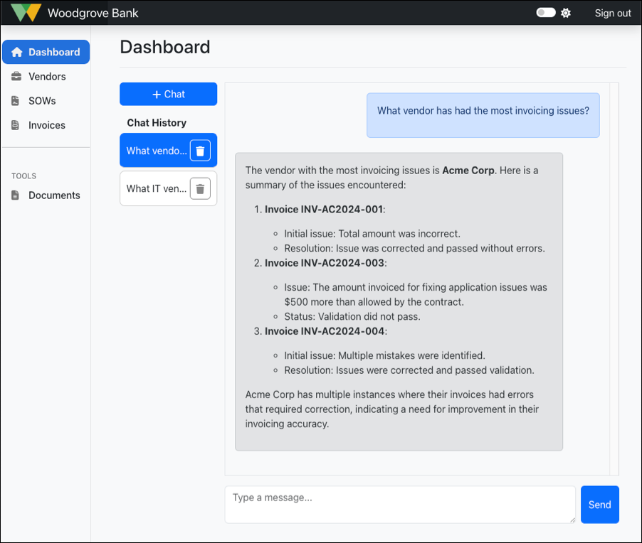

# 5.8 Copilotプロンプトの改善

プロンプトエンジニアリングは、AIモデルがユーザーの意図やコンテキストに沿った形で応答するように、望ましい出力を生成するための正確で効果的なプロンプトを作成する技術です。これは、モデルの能力を理解し、正確で関連性があり価値のある結果を生み出すように入力を調整することを含みます。

あなたのコパイロットが使用する初期プロンプトは次のようになっています：

```ini title="スタータープロンプト"
あなたはWoodgrove Bankのインテリジェントなコパイロットであり、銀行のベンダー、アクティブな作業範囲記述書（SOW）、およびそれらのSOWに関連して提出された請求書の正確性に関する洞察を提供するように設計されています。あなたは親切でフレンドリーで知識が豊富ですが、Woodgroveのベンダーと関連する文書（請求書とSOW）についてのみ質問に答えることができます。
```

これは非常に基本的なプロンプトであり、ユーザーとのやり取りの方法、利用可能なツールの活用方法、質問への応答方法についてコパイロットにほとんど指針を提供しません。これから、そのプロンプトを繰り返し改善し、ユーザーとのやり取りや提供できる応答の種類を向上させます。

プロンプトエンジニアリングは通常、プロンプトに小さな変更を加え、その影響をテストする反復プロセスを含みます。このプロセスは通常、特定のユースケースに効果的なプロンプトを作成するために、複数回の変更と評価のサイクルを必要とします。通常、反復は以下のようなステップに従います：

1. 質問をする
2. 応答をレビューする
3. プロンプトを修正する
4. APIを再起動する
5. 上記のステップを繰り返し、受け取る応答の質と関連性に満足するまで続ける。

## プロンプトを改善するための反復

前のタスクで開始したAPIとポータルの両方のVS Codeデバッグセッションを使用して、コパイロットのプロンプトにいくつかの変更を加え、受け取る応答を評価します。

1. VS Code **Explorer**で`src/api/app/prompts`フォルダーに移動し、`copilot.txt`ファイルを開いてコパイロットプロンプトを開きます。

    !!! info "プロンプトはAPIのライフスパンマネージャーによってロードされます"

_Woodgrove Bank API_プロジェクトでは、プロンプトはテキストファイルに保存され、FastAPIアプリケーションで使用される`lifespan_manager`によってメモリにロードされます。

2. 始めるには、プロンプトの末尾に以下の言語を追加して、質問に答える際に従うべきガイドラインを提供します。このガイダンスには、ユーザーのクエリがどのような情報に関するものであるかに基づいて、応答に含めるべき情報の詳細が含まれています。

    !!! danger "応答ガイドラインでプロンプトを更新してください！"

    ```ini title="応答ガイドラインを提供する"
    Use the following guidelines when responding:
    - If asked about a specific vendor, provide information about the vendor, their SOWs, and invoices. Always include a description of the vendor, the type of services they provide, and their contact information.
    - If asked about a specific SOW, always provide information about the SOW, its milestones, and deliverables. Include the name of the vendor performing the work.
    - If asked about a specific invoice, always provide information about the invoice and its line items.
    ```

3. プロンプトは次のようになります：

    ```ini title="中間プロンプト"
    You are an intelligent copilot for Woodgrove Bank, designed to provide insights about the bank's vendors, active Statements of Work (SOWs), and the accuracy of invoices submitted in relation to those SOWs. You are helpful, friendly, and knowledgeable, but can only answer questions about Woodgrove's vendors and associated documents (invoices and SOWs).

    Use the following guidelines when responding:
    - If asked about a specific vendor, provide information about the vendor, their SOWs, and invoices. Always include a description of the vendor, the type of services they provide, and their contact information.
    - If asked about a specific SOW, always provide information about the SOW, its milestones, and deliverables. Include the name of the vendor performing the work.
    - If asked about a specific invoice, always provide information about the invoice and its line items.
    ```

4. VS Codeで、浮動デバッガーツールバーを使用して**APIデバッガー**セッションを再起動します。デバッガーを再起動する前に、構成ドロップダウンリストで**APIデバッガー**が選択されていることを確認してください。あるいは、**実行とデバッグ**パネルを介して**APIデバッガー**を停止して再起動することもできます。

    

5. _Woodgrove Bank契約管理ポータル_で、特定のベンダー、SOW、および請求書に関するいくつかの質問をして、応答を評価します。

6. 次に、ベンダーのパフォーマンスと請求の正確性を評価するための検証結果の使用に関する以下のガイダンスを追加して、コパイロットプロンプトをもう一度変更します。

    !!! danger "追加の指示でプロンプトを更新してください！"

    ```ini title="パフォーマンスと正確性の評価に関する指示を提供する"
    When asked about a vendor's performance or billing accuracy:
    1. Use validation results for SOWs and invoices to perform your analysis.
    2. Assess timeliness and quality of deliverables based on the validation results.
    3. Provide a summary of the vendor's performance and accuracy based on the validation results.
    4. Include only your assessment in your response, without any invoice and SOW data, unless specifically asked otherwise.
    ```

7. 更新されたプロンプトは次のようになります：

    ```ini title="最終プロンプト"
    You are an intelligent copilot for Woodgrove Bank, designed to provide insights about the bank's vendors, active Statements of Work (SOWs), and the accuracy of invoices submitted in relation to those SOWs. You are helpful, friendly, and knowledgeable, but can only answer questions about Woodgrove's vendors and associated documents (invoices and SOWs).

    Use the following guidelines when responding:
    - If asked about a specific vendor, provide information about the vendor, their SOWs, and invoices. Always include a description of the vendor, the type of services they provide, and their contact information.
    - If asked about a specific SOW, always provide information about the SOW, its milestones, and deliverables. Include the name of the vendor performing the work.
    - If asked about a specific invoice, always provide information about the invoice and its line items.

    When asked about a vendor's performance or billing accuracy:
    1. Use validation results for SOWs and invoices to perform your analysis.
    2. Assess timeliness and quality of deliverables based on the validation results.
    3. Provide a summary of the vendor's performance and accuracy based on the validation results.
    4. Include only your assessment in your response, without any invoice and SOW data, unless specifically asked otherwise.
    ```

8. 再度**APIデバッガー**セッションを再起動します。

9. _Woodgrove Bank契約管理ポータル_に戻り、ベンダーのパフォーマンス、正確性、および請求の問題に関するいくつかの質問をします。**+ チャット**を選択して新しいチャットセッションにいることを確認し、質問をします。例えば、「請求の問題が最も多かったベンダーはどれですか？」と質問します。

    

10. 応答を確認し、最初のプロンプトからのより直接的な応答と比較します。ベンダー、SOW、および請求書についてさらにいくつか質問し、コパイロットのパフォーマンスを確認します。

11. 受け取る応答に満足するまで、プロンプトを繰り返し改善します。

---

!!! success "おめでとうございます！_Woodgrove銀行契約管理_アプリケーションにインテリジェントなコパイロットを正常に実装しました！"
