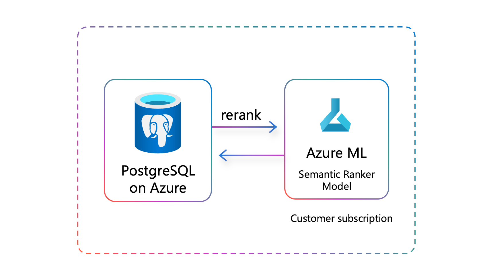

# 6.1 Understand Semantic Ranking

Semantic ranking improves accuracy of the vector search by re-ranking results using a semantic ranker model, which brings more relevant items to the top of the ranked list. In the context of Azure Database for PostgreSQL, _semantic ranking_ can enhance the accuracy and relevance of search results within the database, significantly improving the information retrieval pipelines in Generative AI (GenAI) applications. Unlike vector search, which primarily measures the similarity between two vector embeddings, semantic ranking delves deeper by analyzing the semantic relevance between text strings at the actual text level. This approach ensures that search results are more contextually aligned with user queries, improving information retrieval and higher user satisfaction.

## Reranking Search Results with Semantic Ranker Models

Semantic ranker models compare two text strings: the search query and the text of one of the items being searched. The ranker produces a relevance score that indicates how well the text string matches the query, essentially determining if the text holds an answer to the query. Typically, the semantic ranker is a machine learning model, often a variant of the BERT language model fine-tuned for ranking tasks, but it can also be a large language model (LLM). These ranker models, also called cross-encoder models, take two text strings as input and output a relevance score, usually ranging from 0 to 1.

## Semantic Ranker Model Inference from PostgreSQL

The `azure_ai` extension enables two methods for the invocation of reranker models. Using either method, inference with a semantic ranker model can be performed directly through SQL queries. Both techniques allow for the reranking of vector search results based on the semantic relevance of the text, rather than relying solely on keyword matching.

### `azure_ml.invoke()`

The first technique is to call machine learning models deployed on [Azure Machine Learning online endpoints](https://learn.microsoft.com/azure/machine-learning/concept-endpoints-online) directly from within PostgreSQL using the `azure_ml.invoke()` method of the Azure AI extension.

### The `rank` Semantic Operator

The second approach is to take advantage of the newly introduced [Semantic Operators](https://learn.microsoft.com/azure/postgresql/flexible-server/generative-ai-azure-ai-semantic-operators) in the Azure AI extension. Semantic Operators are designed to simplify complex AI-driven tasks directly within your PostgreSQL database by allowing you to seamlessly integrate generative AI capabilities into SQL workflows, enabling advanced text generation, truth evaluation, entity extraction, and ranking. Each operator is optimized for ease of use and flexibility, allowing developers to build intelligent applications with minimal effort.

The [`rank` operator](https://learn.microsoft.com/azure/postgresql/flexible-server/generative-ai-azure-ai-semantic-operators#azure_airank) reranks results based on their relevance to a given query. It supports cross-encoder and GPT models.

For this solution accelerator, we will focus on the `rank` Semantic Operator.
