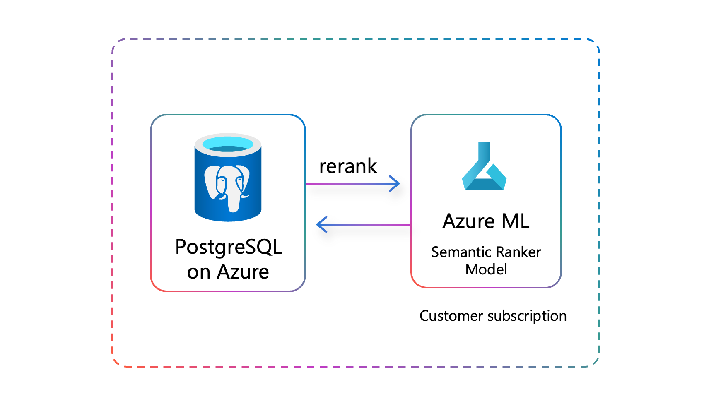

# 6.1 セマンティックランキングを理解する {/*examples*/}

セマンティックランキングは、セマンティックランカーモデルを使用して結果を再ランキングすることで、ベクター検索の精度を向上させ、より関連性の高い項目をランキングリストの上位に持ってきます。Azure Database for PostgreSQL のコンテキストでは、_セマンティックランキング_ はデータベース内の検索結果の精度と関連性を向上させ、生成的 AI (GenAI) アプリケーションにおける情報検索パイプラインを大幅に改善します。ベクター検索が主に2つのベクター埋め込み間の類似性を測定するのに対し、セマンティックランキングはテキスト文字列間のセマンティックな関連性を実際のテキストレベルで分析することで、より深く掘り下げます。このアプローチにより、検索結果がユーザーのクエリとより文脈的に一致し、情報検索が改善され、ユーザーの満足度が向上します。

## セマンティックランカーモデルによる検索結果の再ランキング {/*examples*/}

セマンティックランカーモデルは、検索クエリと検索対象の項目のテキストという2つのテキスト文字列を比較します。ランカーは、テキスト文字列がクエリにどれだけ一致しているかを示す関連性スコアを生成し、テキストがクエリに対する答えを持っているかどうかを基本的に判断します。通常、セマンティックランカーは機械学習モデルであり、ランキングタスク用に微調整されたBERT言語モデルのバリアントであることが多いですが、大規模言語モデル（LLM）であることもあります。これらのランカーモデルは、クロスエンコーダーモデルとも呼ばれ、2つのテキスト文字列を入力として受け取り、通常0から1の範囲の関連性スコアを出力します。

## PostgreSQLからのセマンティックランカーモデル推論 {/*examples*/}

`azure_ai` 拡張機能を使用すると、[Azure Machine Learning オンラインエンドポイント](https://learn.microsoft.com/azure/machine-learning/concept-endpoints-online) にデプロイされた機械学習モデルを PostgreSQL 内から直接呼び出すことができます。

`azure_ml.invoke()` メソッドを使用することで、SQL クエリを通じてセマンティックランカーモデルによる推論を行うことができます。これにより、キーワードマッチングにのみ依存するのではなく、テキストのセマンティックな関連性に基づいてベクター検索結果を再ランキングすることが可能になります。

It seems like you haven't pasted any content yet. Please provide the Markdown content you want translated, and I'll assist you with the translation.
