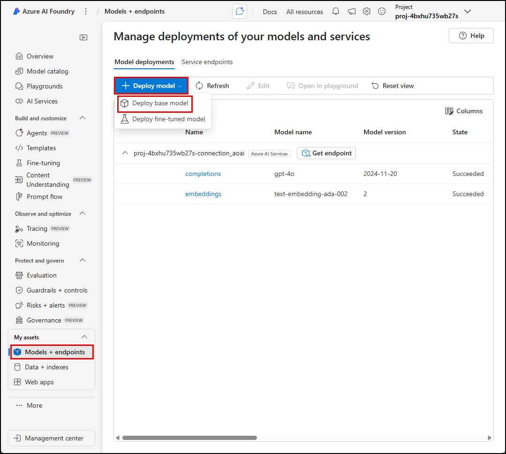
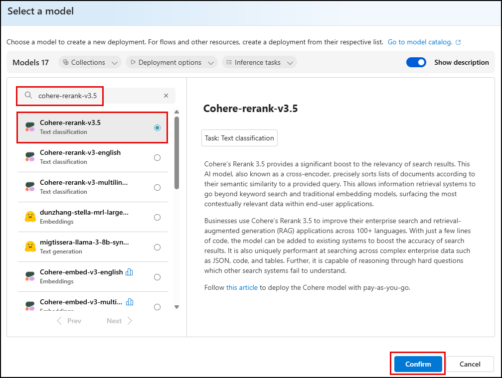
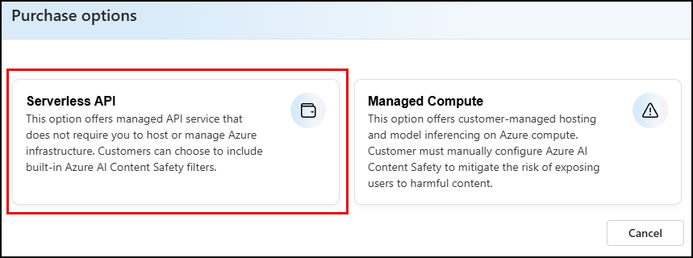
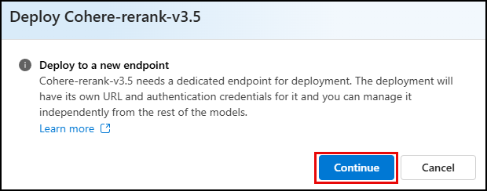
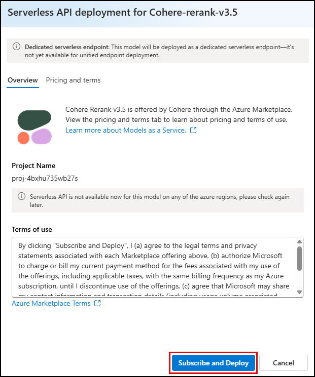
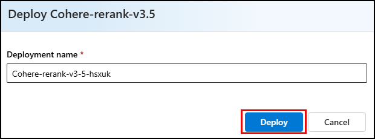
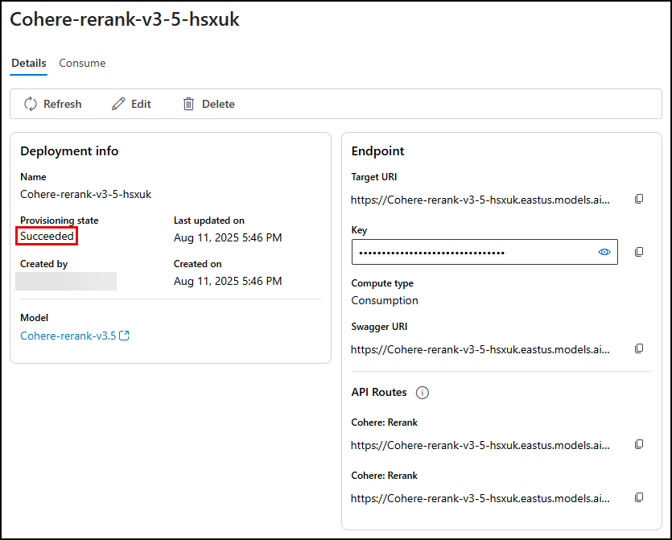
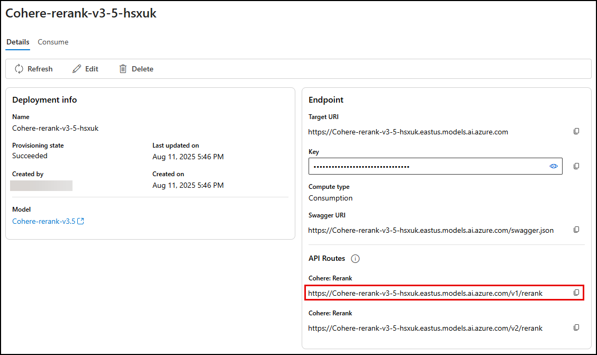

# 6.2 Use Semantic Ranking in PostgreSQL

By leveraging the power of _semantic re-ranking_, you can improve the accuracy of data retrieval and help ensure the success of your Generative AI applications. In this task, you will call a cross encoder model using [the `rank` Semantic Operator in the Azure AI extension](https://learn.microsoft.com/azure/postgresql/flexible-server/generative-ai-azure-ai-semantic-operators#azure_airank) to seamlessly perform semantic ranking directly within SQL queries.

## Deploy a reranking model

Before using the `rank` semantic operator in your queries, you must deploy a reranking model. In addition to supporting LLMs for reranking, the operator also accommodates cross-encoder models specifically designed for this function. For this accelerator, you will use the **Cohere Rerank v3.5** cross-encoder model, available in the Azure AI Foundry model catalog. Cohere Rerank v3.5 is a fast and cost-effective model for performing reranking.

1. In a web browser, navigate to your Azure AI project resource (the name starts with `proj-`), and select **Launch studio** to open the project in the Azure AI Foundry portal.

2. Select **Models + endpoints** under **My assets** in the left-hand menu.

3. On the **Manage deployments of your models and services** page, select **Deploy model** and then select **Deploy base model** from the context menu.

    

4. In the **Select a model** dialog, enter "cohere-rerank-v3.5" into the _Search_ filter, select the **Cohere-rerank-v3.5** Text classification model, and then select **Confirm**.

    

5. On the **Purchase options**, select **Serverless API**.

    

6. On the **Deploy Cohere-rerank-v3.5** dialog, select **Continue**.

    

7. On the **Serverless API deployment for Cohere-rerank-v3.5** dialog, select **Subscribe and Deploy**.

    

8. In the **Deploy Cohere-rerank-v3.5** dialog, accept the **Deployment name** by selecting **Deploy**.

    

9. The model subscription and serverless endpoint deployment may take a couple of minutes to complete. Wait until the **Provisioning state** changes from **Creating** to **Succeeded** before moving on.

    

10. Leave the Cohere Rerank v3.5 model deployment page open for subsequent tasks.

## Connect the Azure AI extension to your reranker model endpoint

To configure the `azure_ai` extension's connection to your reranker model endpoint, you will use **PostgreSQL in VS Code** to execute the required SQL commands against your database.

1. Return to **VS Code**, select the PostgreSQL extension icon (elephant) from the _Activity Bar_, and ensure it is connected to your PostgreSQL database.

2. In the PostgreSQL **Connections** dialog, expand **Databases** under your PostgreSQL server.

3. Right-click the **contracts** database and select **New Query** from the context menu.

4. In the PostgreSQL query window, paste the following SQL commands to configure the extension's connection to your serverless rerank endpoint using the `set_setting()` function. Do not run the commands yet, as you first need to retrieve the endpoint URL from Azure AI Foundry.

    ```sql title="" linenums="0"
    -- Use managed identity for Azure 
    SELECT azure_ai.set_setting('azure_ml.auth_type', 'managed-identity');
    -- Add the serverless reranking endpoint
    SELECT azure_ai.set_setting('azure_ml.serverless_ranking_endpoint', '<endpoint>');
    ```

5. Return to the **Cohere-rerank-v3.5** deployment page in the Azure AI Foundry portal, and copy the **Cohere: Rerank** value for the `v1/rerank` endpoint under **API Routes**.

    

6. Replace the `<endpoint>` token in the setting for the `azure_ml.serverless_ranking_endpoint` with the copied URL, then execute the updated SQL commands by selecting the **Execute PostgreSQL Query** button in the PostgreSQL query window in VS Code.

## Test reranking

The `azure_ai.rank()` semantic operator enhances search results by reordering, or ranking, them based on their semantic relevance to a given query. It empowers businesses to substantially improve the accuracy and relevance of information retrieved in search and retrieval-augmented generation (RAG) systems.

To see how _semantic ranking_ works in your queries, you can execute a few test queries from **PostgreSQL in VS Code**. The example below inspects the results of a vector search, and then shows how to perform semantic reranking of those for the query "cost management and optimization" over the `sow_chunks` table using the `azure_ai.rank()` operator.

1. Open a new query window in **PostgreSQL in VS Code**, run the following query to perform a vector search on the `sow_chunks` table.

    !!! danger "Execute the following SQL command in PostgreSQL in VS Code!"

    ```sql title="Vector search query" linenums="0"
    SELECT id, content FROM sow_chunks
    ORDER BY embedding <=> azure_openai.create_embeddings('embeddings', 'cost management and optimization')::vector
    LIMIT 10;
    ```

    In the **PostgreSQL Query Results** pane in VS Code, review the output of the query. It includes the top five matches relating to "cost management and optimization," but reading the results you will observe that they are not all relevant or accurate.

2. To see how semantic reranking improves both relevance and accuracy, run the following query, and observe how the results differ from only performing a vector search.

    !!! danger "Execute the following SQL command in PostgreSQL in VS Code!"

    ```sql title="Semantic ranking query" linenums="0"
    WITH vector_results AS (
        SELECT id, content FROM sow_chunks
        ORDER BY embedding <=> azure_openai.create_embeddings('embeddings', 'cost management and optimization')::vector
        LIMIT 10
    )
    SELECT id, rank, score, content
    FROM azure_ai.rank(
        'cost management and optimization',
        ARRAY(SELECT content FROM vector_results),
        ARRAY(SELECT id FROM vector_results)
    ) r
    LEFT JOIN vector_results vr USING (id)
    ORDER BY rank ASC
    LIMIT 10;
    ```

    The above query combines the previous vector search query with a call to the `azure_ai.rank` operator. Vector search results are passed into the `rank` function via a common table expression (CTE) as arrays of text values and associated Ids. The query output displays the original vector search results ordered by their semantic rank.

    ???+ info "Understand the `rank` operator"

        The `rank` semantic operator enhances search results by re-ranking them based on their semantic relevance to a given query. Here's a breakdown of how it works:

        **Function Arguments**

        The `rank` function has the following two signatures:

        ```sql title="rank() function signatures"
        azure_ai.rank(query text, document_contents text[], model text DEFAULT 'Cohere-rerank-v3.5'::text)
        azure_ai.rank(query text, document_contents text[], document_ids anyarray, model text DEFAULT 'Cohere-rerank-v3.5'::text)
        ```

        **Input Parameters**

        - `query`: A text string representing the search query.
        - `document_contents`: An array of text strings representing vector search results.
        - `document_ids`: (Optional) An array of Ids associated with the vector search results.
        - `model`: The reranking model to use. Defaults to `Cohere-rerank-v3.5` if not specified.

        **Return Value**

        - The function returns a table with three columns:
          - `id` (the Id of the original vector search result)
          - `rank` (a BIGINT value representing the rank of the result in order of the highest score)
          - `score` (a NUMERIC object representing the relevance score)

        **Execution**

        - **Json Pairs Construction**: The function starts by constructing a JSON object that pairs the searcf query with each initial vector search result and its associated Id.
        - **Relevance Scoring**: It then calls the rerank endpoint of the `model`, which computes the relevance scores for each pair.
        - **Rank Assignment**: The relevance scores are put in order from highest to lowest and assigned rank numbers to designate their ordinal position.
        - **Combining Results**: Finally, the function outputs the Ids from the original vector search results with corresponding ranks and relevance scores, ensuring that each result is paired with the correct relevance score.

    Inspecting the output of the reranking query in the **PostgreSQL Query Results** panel in VS Code, the results are in a different order than when performing vector search alone. Reviewing the `content` values for the highest ranked results reveals that they are much more closely aligned with the "cost management and optimization" query text, indicating the most relevant and accurate results are scored the highest.

---

Next, you will update the `get_sow_chunks` function used by your copilot to use semantic ranking to improve the accuracy and quality of the copilot's responses.
