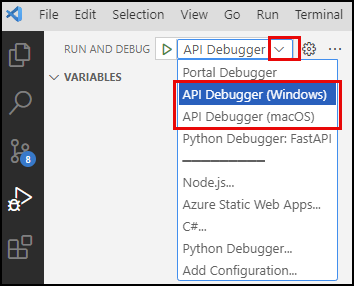
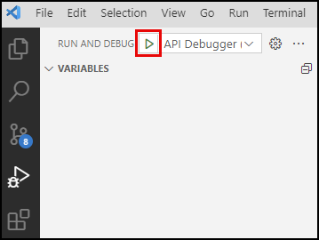
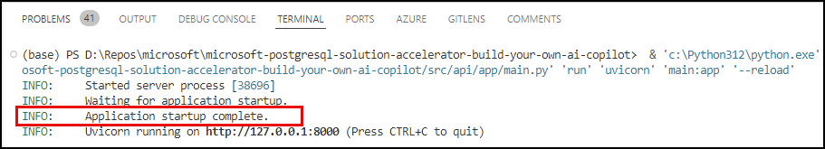
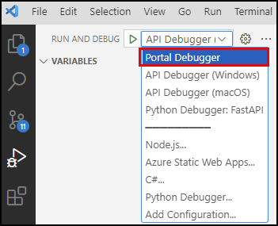

# 6.3 Update Copilot With Semantic Ranking

The next step is to update your API to use the semantic ranking capability. For this, you will update how it finds and retrieves SOW chunks, which are the blocks of content extracted from each SOW uploaded into the application.

## Review the function

Following the _function calling_ pattern used by your LangChain agent to retrieve data from the database, you will use a Python function to execute semantic ranking queries from your copilot. Within the `src/api/app/functions/chat_functions.py` file, the `find_sow_chunks_with_semantic_ranking` function has been provided for executing reranking queries using a query similar to the one you ran in the previous task. Open it now in Visual Studio Code and explore the code with the function. You can also expand the section below to see the code inline.

???+ info "Find SOW Chunks with Semantic Ranking code"

    ```python linenums="1" title="src/api/app/functions/chat_functions.py"
    async def find_sow_chunks_with_semantic_ranking(self, user_query: str, sow_id: int = None, max_results: int = 3):
        """
        Retrieves content chunks similar to the user query for the specified SOW.
        """

        # Create a vector search query
        cte_query = f"SELECT id, content FROM sow_chunks"
        cte_query += f" WHERE sow_id = {sow_id}" if sow_id is not None else ""
        cte_query += f" ORDER BY embedding <=> azure_openai.create_embeddings('embeddings', '{user_query}')::vector"
        cte_query += f" LIMIT 10"

        # Create the semantic ranker query
        query = f"""
        WITH vector_results AS (
            {cte_query}
        )
        SELECT id, rank, score, content
        FROM azure_ai.rank(
            '{user_query}',
            ARRAY(SELECT content from vector_results),
            ARRAY(SELECT id from vector_results)
        ) r
        LEFT JOIN vector_results vr USING (id)
        ORDER BY rank DESC
        LIMIT {max_results};
        """

        rows = await self.__execute_query(f'{query};')
        return [dict(row) for row in rows]
    ```

1. **Create vector search query** (lines 7-10): The `rank` operator expects vector search results as input, so a vector search query is created. The query selects the `id` and `content` fields from the `sow_chunks` table and orders them by semantic similarity.

2. **Create a semantic ranker query** (lines 13-26):

    - **Create CTE** (lines 14-16): A common table expression (CTE) executes the vector search query and extracts ids and content values from that query.
    - **Execute the `azure_ai.rank` semantic operator** (lines 17-24): Using the output of the CTE, the results are reranked using the `rank` operator.
    - **Limit results** (line 25): The number of results is limited to ensure the more relevant records are sent to the LLM.

3. **Return the results** (lines 28-29): The query results are extracted and returned to the LLM.

## Implement semantic ranker

To use the semantic ranking functionality instead of the vector search to retrieve SOW chunks, you must replace the function assigned to your LangChain agent's `tools` collection. You will replace the `find_sow_chunks` _tool_ with the `find_sow_chunks_with_semantic_ranking` function.

1. In the VS Code **Explorer**, navigate to the `src/api/app/routers` folder and open the `completions.py` file.

2. Within the `tools` array, locate the following line:

    ```python title="" linenums="69"
    StructuredTool.from_function(coroutine=cf.find_sow_chunks),
    ```

3. Replace that line with the following:

    !!! danger "Insert the code to use the semantic ranking function!"

    ```python title="" linenums="69"
    StructuredTool.from_function(coroutine=cf.find_sow_chunks_with_semantic_ranking),
    ```

4. Your new `tools` array should look like this:

    ```python title="tools array definition" linenums="63" hl_lines="7"
    # Define tools for the agent to retrieve data from the database
    tools = [
        # Hybrid search functions
        StructuredTool.from_function(coroutine=cf.find_invoice_line_items),
        StructuredTool.from_function(coroutine=cf.find_invoice_validation_results),
        StructuredTool.from_function(coroutine=cf.find_milestone_deliverables),
        StructuredTool.from_function(coroutine=cf.find_sow_chunks_with_semantic_ranking),
        StructuredTool.from_function(coroutine=cf.find_sow_validation_results),
        # Get invoice data functions
        StructuredTool.from_function(coroutine=cf.get_invoice_id),
        StructuredTool.from_function(coroutine=cf.get_invoice_line_items),
        StructuredTool.from_function(coroutine=cf.get_invoice_validation_results),
        StructuredTool.from_function(coroutine=cf.get_invoices),
        # Get SOW data functions
        StructuredTool.from_function(coroutine=cf.get_sow_chunks),
        StructuredTool.from_function(coroutine=cf.get_sow_id),
        StructuredTool.from_function(coroutine=cf.get_sow_milestones),
        StructuredTool.from_function(coroutine=cf.get_milestone_deliverables),
        StructuredTool.from_function(coroutine=cf.get_sow_validation_results),
        StructuredTool.from_function(coroutine=cf.get_sows),
        # Get vendor data functions
        StructuredTool.from_function(coroutine=cf.get_vendors)
    ]
    ```

5. Save the `completions.py` file.

## Test with VS Code

As you have done previously, you will test your updates using Visual Studio Code.

### Start the API

Follow the steps below to start a debug session for the API in VS Code.

1. In Visual Studio Code **Run and Debug** panel, select the **API Debugger** option for your OS from the debug configurations dropdown list.

    

2. Select the **Start Debugging** button (or press F5 on your keyboard).

    

3. Wait for the API application to start completely, indicated by an `Application startup complete.` message in the terminal output.

    

### Start the Portal

With the API running, you can start a second debug session in VS Code for the Portal project.

1. Return to the **Run and Debug** panel in Visual Studio Code and select the **Portal Debugger** option from the debug configurations dropdown list.

    

2. Select the **Start Debugging** button (or press F5 on your keyboard).

    

3. This should launch the _Woodgrove Bank Contract Management Portal_ in a new browser window (<http://localhost:3000/>).

4. On the **Dashboard** page, enter the following message into the chat and send it:

    !!! danger "Paste the following prompt into the copilot chat box!"

    ```bash title="" linenums="0"
    Show me SOWs pertaining to cost management and optimization.
    ```

5. Observe the results provided using the `rank` semantic operator.

!!! success "Congratulations! You just learned how to leverage the semantic ranking capabilities in Azure Database for PostgreSQL!"
