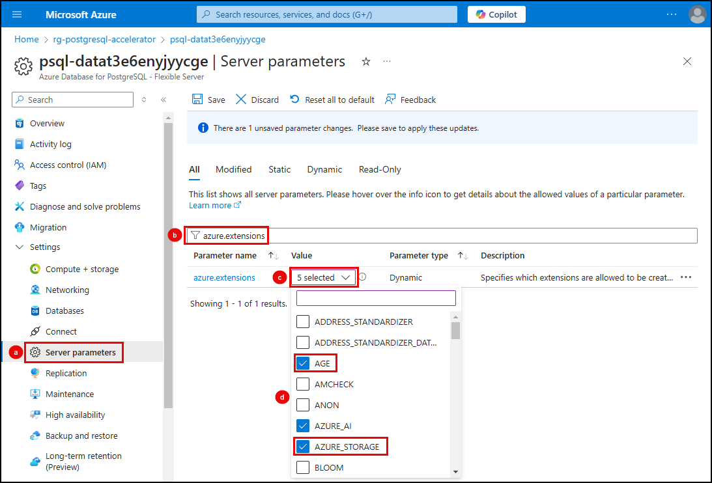

# 6.5 AGEを有効にする

**Apache AGE** (`age`) 拡張機能は、PostgreSQLをグラフデータベースとして使用できるようにし、相互に関連するデータを分析するための包括的なソリューションを提供します。`age`を使用すると、グラフ構造を使用して複雑なデータ関係を定義およびクエリできます。

PostgreSQLデータベースからAzure Blob StorageにホストされているCSVファイルへのデータ抽出を簡素化するために、[Azure Storage拡張機能](https://learn.microsoft.com/azure/postgresql/flexible-server/how-to-use-pg-azure-storage) (`azure_storage`) も使用します。この拡張機能を使用すると、PostgreSQLデータベースから直接Azure Storageアカウントに接続し、データベースからデータをコピーして、Blobストレージ内のファイルに書き込むことができます。ストレージアカウントから、CSVファイルはグラフデータベースのデータソースとして使用されます。

## 拡張機能を許可リストに追加する

`age`および`azure_storage`拡張機能を使用する前に、PostgreSQLサーバーの_許可リスト_に追加し、共有プリロードライブラリとして構成し、データベースにインストールします。

!!! note "_拡張機能を許可リストに追加するために使用したい方法のタブを選択し、提供された指示に従ってください。_"

=== "Azure CLI"

    1. VS Codeで新しい統合ターミナルウィンドウを開き、プロンプトで次のAzure CLIコマンドを実行します。

        !!! note "以下のコマンド内のトークンをAzure環境からの適切な値に置き換えることを確認してください。"
    
            - **[YOUR_RESOURCE_GROUP]**: Azure Database for PostgreSQLフレキシブルサーバーをホストしているリソースグループの名前。
            - **[YOUR_POSTGRESQL_SERVER]**: Azure Database for PostgreSQLサーバーの名前。
            - **[YOUR_SUBSCRIPTION_ID]**: AzureサブスクリプションID。
        
        !!! danger "次のAzure CLIコマンドを実行してください！"

        ```bash
        az postgres flexible-server parameter set --resource-group [YOUR_RESOURCE_GROUP] --server-name [YOUR_POSTGRESQL_SERVER] --subscription [YOUR_SUBSCRIPTION_ID] --name azure.extensions --value azure_ai,pg_diskann,vector,age,azure_storage
        ```

=== "Azure portal"

    1. [Azure portal](https://portal.azure.com/)で、Azure Database for PostgreSQL フレキシブル サーバー インスタンスに移動します。

    2. 左側のリソース メニューから:
        1. **設定**セクションを展開し、**サーバー パラメーター**を選択します。
        2. 検索フィルターに「azure.extensions」と入力します。
        3. **VALUE** ドロップダウン リストを展開します。
        4. **VALUE** ドロップダウン リストで、**AGE** と **AZURE_STORAGE** 拡張機能のボックスをチェックして選択します。

        

## サーバー起動時に拡張機能を読み込む

一部のPostgresライブラリは、共有メモリの割り当て、軽量ロックの予約、バックグラウンドワーカーの開始など、postmasterの起動時にのみ実行できる特定の操作を行う必要があります。`AGE`はその操作に共有メモリを使用するため、サーバー起動時に読み込む必要があります。PostgreSQLの`shared_preload_libraries`パラメーターは、サーバー起動時に読み込むべきライブラリを指定し、接続が行われる前に追加の機能や拡張機能を有効にします。

!!! note "_`shared_preload_libraries`パラメーターを更新するために使用したい方法のタブを選択し、提供された指示に従ってください。_"

=== "Azure CLI"

    1. VS Codeの統合ターミナルウィンドウで、プロンプトで次のAzure CLIコマンドを実行します。

        !!! note "以下のコマンドのトークンを、Azure環境からの適切な値に置き換えてください。"
    
            - **[YOUR_RESOURCE_GROUP]**: Azure Database for PostgreSQL フレキシブル サーバーをホストしているリソース グループの名前。
            - **[YOUR_POSTGRESQL_SERVER]**: Azure Database for PostgreSQL サーバーの名前。
            - **[YOUR_SUBSCRIPTION_ID]**: AzureサブスクリプションID。

        !!! danger "次のAzure CLIコマンドを実行してください！"

        ```bash
        az postgres flexible-server parameter set --resource-group [YOUR_RESOURCE_GROUP] --server-name [YOUR_POSTGRESQL_SERVER] --subscription [YOUR_SUBSCRIPTION_ID] --name shared_preload_libraries --value age,azure_storage,pg_cron,pg_stat_statements
        ```

    
        !!! info "`pg_cron` と `pg_stat_statements` はデフォルトで設定されているため、`shared_preload_libraries` パラメータから削除されないように、上記のコマンドに含まれています。"

    2. 上記のコマンドはパラメータを設定しますが、PostgreSQL フレキシブル サーバーの設定を有効にするには再起動が必要です。サーバーを再起動するには、次のコマンドを実行します。

        !!! note "以下のコマンド内のトークンを、Azure 環境から適切な値に置き換えてください。"
    
            - **[YOUR_RESOURCE_GROUP]**: Azure Database for PostgreSQL フレキシブル サーバーをホストしているリソース グループの名前。
            - **[YOUR_POSTGRESQL_SERVER]**: Azure Database for PostgreSQL サーバーの名前。
            - **[YOUR_SUBSCRIPTION_ID]**: Azure サブスクリプション ID。

        !!! danger "次の Azure CLI コマンドを実行してください！"

        ```bash
        az postgres flexible-server restart --resource-group [YOUR_RESOURCE_GROUP] --name [YOUR_POSTGRESQL_SERVER] --subscription [YOUR_SUBSCRIPTION_ID]
        ```

=== "Azure portal"

    1. [Azure portal](https://portal.azure.com/) の Azure Database for PostgreSQL フレキシブル サーバー インスタンスの **サーバー パラメーター** ページで：

        1. 検索フィルターに「shared_preload」と入力します。
        2. **VALUE** ドロップダウンリストを展開します。
        3. **VALUE** ドロップダウンリストで、**AGE** と **AZURE_STORAGE** 拡張機能を選択するために、それぞれのボックスをチェックします。
        4. ツールバーで **保存** を選択します。

        

    2. **保存** を選択すると、PostgreSQL サーバーの再起動がトリガーされ、完了するまでに数秒かかります。

    3. 表示される _サーバー パラメーターの保存_ ダイアログで、**保存して再起動** を選択します。

        

## Install extensions

`AGE` と `AZURE_STORAGE` 拡張機能を _allowlist_ に追加し、PostgreSQL サーバーにロードしたら、[CREATE EXTENSION](https://www.postgresql.org/docs/current/sql-createextension.html) コマンドを使用してデータベースにインストールできます。

!!! warning "現時点では、AGE 拡張機能はプレビュー中であり、少なくとも PG13 から PG16 までを実行している新しく作成された Azure Database for PostgreSQL Flexible Server インスタンスでのみ利用可能です。"

**pgAdmin** を使用して、データベースに対して SQL コマンドを実行して拡張機能をインストールします。

1. ローカルマシンで、開いている **pgAdmin** のインスタンスに戻る（またはセットアップタスクの後に閉じた場合は開く）し、PostgreSQL データベースに接続されていることを確認します。

2. pgAdmin の **Object Explorer** で、PostgreSQL サーバーの下にあるデータベースを展開します。

3. **contracts** データベースを右クリックし、コンテキストメニューから **Query Tool** を選択します。

4. 次の `CREATE EXTENSION` コマンドを pgAdmin のクエリウィンドウで実行して、`age` と `azure_storage` 拡張機能をインストールします。

    !!! danger "次の SQL コマンドを pgAdmin で実行してください！"

    ```sql title=""
    CREATE EXTENSION IF NOT EXISTS age;
    CREATE EXTENSION IF NOT EXISTS azure_storage;
    ```
