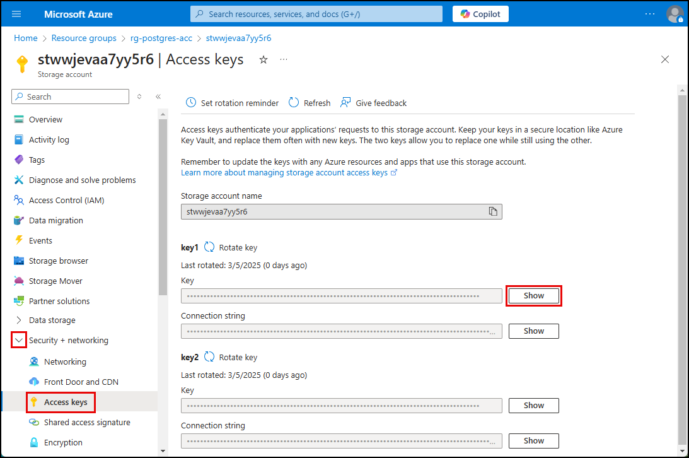

# 6.6 グラフデータのエクスポート

PostgreSQLデータベースからデータをエクスポートして、グラフデータベースを構築する必要があります。Azure Database for PostgreSQLのAzure Storage (`azure_storage`) 拡張機能を使用すると、PostgreSQLデータベースからAzure Blob StorageのCSVファイルにデータをコピーするための効率的な方法が提供されます。`AGE`とグラフデータベースへのデータロードの文脈では、`azure_storage` 拡張機能はPostgreSQLデータベースからリレーショナルデータを抽出し、Blob Storageへの効率的な転送を可能にします。このプロセスにより、グラフデータベースの構築とクエリに必要なデータがすぐに利用可能になり、データワークフローにシームレスに統合できます。

## データベースをAzure Storageに接続する

**pgAdmin**を使用して、データベースに対してSQLコマンドを実行し、`azure_storage` 拡張機能のストレージアカウントへの接続を設定します。

!!! note "以下のコマンドのトークンをAzure環境から適切な値に置き換えてください。"

    以下で実行する各SQLステートメントには、`[YOUR_STORAGE_ACCOUNT_NAME]` トークンが含まれています。クエリを実行する前に、このトークンをAzureポータルからコピーできる_ストレージアカウント_リソースの名前に置き換える必要があります。

1. ローカルマシンで、**pgAdmin**の開いているインスタンスに戻り（閉じている場合は開いて）、PostgreSQLデータベースに接続されていることを確認します。

2. pgAdminの**オブジェクトエクスプローラー**で、PostgreSQLサーバーの下にあるデータベースを展開します。

3. **contracts**データベースを右クリックし、コンテキストメニューから**クエリツール**を選択します。

4. 次のコマンドを実行して、`azure_storage.account_add()` 関数を使用して、ストレージアカウントとPostgreSQLデータベース間の接続を定義します。アカウント名とキーのトークンをストレージアカウントの値に置き換えてください。

    !!! danger "以下のSQLコマンドをpgAdminで実行してください！"

    ```sql
    SELECT azure_storage.account_add('[YOUR_STORAGE_ACCOUNT_NAME]', '[YOUR_STORAGE_ACCOUNT_KEY]');
    ```

    ??? tip "ストレージアカウントキーの見つけ方がわからない場合は？"

ストレージ アカウントのアクセス キーを取得するには:

1. Azure ポータルでストレージ アカウントに移動します。
2. ナビゲーション メニューの **セキュリティ + ネットワーキング** の下にある **アクセス キー** メニューを選択します。
3. **key1** の下にある **キー** 値の横にある **表示** を選択します。
4. **キー** ボックスの右側に表示される **クリップボードにコピー** ボタンを選択します。
5. コピーしたキーを上記の SQL ステートメントの `[YOUR_STORAGE_ACCOUNT_KEY]` 値として貼り付けます。

   

## データを BLOB ストレージにエクスポートする {/*examples*/}

データ エクスポート プロセスの一環として、クエリを使用してソース データを再構成し、グラフ データベースでノードとエッジを効率的に定義するために必要な形式に変換します。従来のリレーショナル データベースはデータをテーブルに整理しますが、グラフ データベースはノードとエッジを使用してエンティティとその関係を表します。表形式のデータをノードとエッジに変換することで、グラフ構造に適合し、関係分析がより効率的になります。この変換により、現実世界のエンティティの自然なモデリングが可能になり、クエリのパフォーマンスが最適化され、ベンダー、SOW、および関連する請求書間の接続を評価するなど、複雑な関係分析が可能になります。データを再構成することで、`AGE` と Azure Database for PostgreSQL の強みを最大限に活用し、より深い洞察と高度な分析を実現できます。

グラフ データベースに 2 つの _ノード_ と 1 つの _エッジ_ を定義します。ノードにはデータ ベンダーと SOW データが含まれます。エッジはこれらの関係を定義します。

`azure_storage` 拡張機能を活用してデータ エクスポート クエリを実行するには、**pgAdmin** を使用します。

1. 開いている **pgAdmin** の **クエリ ツール** に戻ります。

2. `azure_storage.blob_put()` 関数を使用して次のクエリを実行し、`vendors` テーブルのすべてのデータを `vendors.csv` という名前の CSV ファイルに書き込み、ストレージ アカウントの `graph` コンテナーに保存します。このデータは、グラフ データベース内の `vendor` ノードを定義します。

    !!! danger "以下のSQLコマンドをpgAdminで実行してください！"

    ```sql
    -- Extract data for the vendors node
    SELECT azure_storage.blob_put(
        '[YOUR_STORAGE_ACCOUNT_NAME]',
        'graph',
        'vendors.csv',
        vendors,
        'csv',
        'none',
        azure_storage.options_csv_put(header:=true)
    )
    FROM (
        SELECT * FROM vendors
    ) AS vendors;
    ```

3. このクエリを実行して、`sows`テーブルから`sow`ノードデータを抽出し、ストレージアカウントの`graph`コンテナに`sows.csv`という名前のCSVファイルに書き込みます。このクエリは、`sows`テーブルのいくつかの列を除外します。これには、グラフデータベースでは不要でエラーを引き起こす可能性のある`embedding`列が含まれます。

    !!! danger "以下のSQLコマンドをpgAdminで実行してください！"

    ```sql
    -- Extract data for the SOWs node
    SELECT azure_storage.blob_put(
        '[YOUR_STORAGE_ACCOUNT_NAME]',
        'graph',
        'sows.csv',
        sows,
        'csv',
        'none',
        azure_storage.options_csv_put(header:=true)
    )
    FROM (
        SELECT id, number, vendor_id, start_date, end_date, budget FROM sows
    ) AS sows;
    ```

4. 最後に、以下のクエリを実行して、`invoices`テーブルから`has_invoices`エッジデータを抽出し、ストレージアカウントの`graph`コンテナに`has_invoices.csv`という名前のCSVファイルに書き込みます：

    !!! danger "以下のSQLコマンドをpgAdminで実行してください！"

    ```sql
    -- Create the has_invoices edge
    SELECT azure_storage.blob_put(
        '[YOUR_STORAGE_ACCOUNT_NAME]',
        'graph',
        'has_invoices.csv',
        invoices,
        'csv',
        'none',
        azure_storage.options_csv_put(header:=true)
    )
    FROM (
        SELECT id, vendor_id as start_id, 'vendor' AS start_vertex_type, sow_id AS end_id, 'sow' AS end_vertex_type, number, amount, invoice_date, payment_status FROM invoices
    ) AS invoices;
    ```

    !!! note "エッジ定義の詳細"

        `AGE`を使用する場合、エッジにはノード間の関係に関する詳細が含まれている必要があります。これらは、上記のクエリで`start_id`、`start_vertex_type`、`end_id`、`end_vertex_type`列を指定することで定義されています。'_id'列はそれぞれ`vendor_id`と`sow_id`にマッピングされ、開始および終了の頂点タイプはIDに関連付けられたノードタイプを指定する文字列です。

## CSVファイルの確認

`azure_storage`拡張機能を使用して、CSVファイルがストレージアカウントの`graph`コンテナに正常に書き込まれたことを確認できます。

1. **pgAdmin**の**クエリツール**で以下のクエリを実行します。`[YOUR_STORAGE_ACCOUNT_NAME]`トークンをストレージアカウントの名前に置き換えることを忘れないでください。

    !!! danger "以下のSQLコマンドをpgAdminで実行してください！"

    ```sql
    -- CSVファイルがBLOBストレージに書き込まれたことを確認
    SELECT azure_storage.blob_list('[YOUR_STORAGE_ACCOUNT_NAME]', 'graph');
    ```

2. **pgAdmin**の**データ出力**パネルに、上記でエクスポートした3つのCSVファイルを含むBLOBのリストが表示されるはずです。

!!! success "おめでとうございます！グラフデータベースを作成するためのデータのエクスポートに成功しました！"

It seems like you haven't pasted any content yet. Please provide the Markdown content you want translated, and I'll assist you with the translation.
