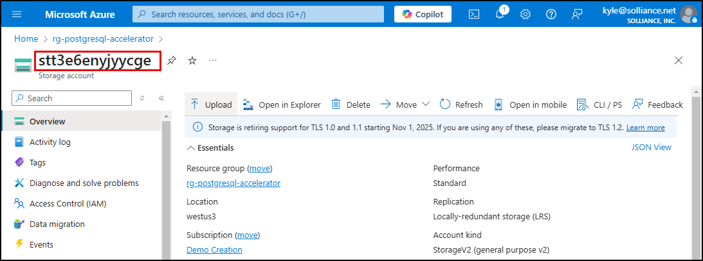

# 6.7 グラフデータベースの作成

Apache AGE拡張機能を使用してAzure Database for PostgreSQLにグラフデータベースをホスティングすることは、データ内の関係を分析する強力な方法を提供します。AGEは、openCypherクエリ言語を活用して効率的なグラフ処理を行い、グラフデータとリレーショナルデータをシームレスに統合します。この統合により、PostgreSQLのスケーラビリティ、パフォーマンス、およびセキュリティが提供される一方で、高度なデータ分析と管理が可能になります。コパイロットに組み込まれると、このセットアップにより、請求書の検証を通じてSOWの成果物のベンダーパフォーマンスを評価することができ、データ駆動型の意思決定が堅牢で洞察に満ちたものになります。

グラフデータベースを作成すると、それはコパイロットに利用可能な追加ツールとして_Woodgrove Bank API_に組み込まれ、関連データを取得する際のRAGの精度を向上させることができます。別の関数呼び出しを使用することで、コパイロットはAzure Database for PostgreSQLにホストされたグラフデータベースに対してAGEを使用してcypherクエリを実行し、Postgresでのデータクエリの既存の機能を維持することができます。

## Woodgroveグラフ

グラフデータベースは、ノードとエッジを使用してデータ間の複雑な関係をモデル化し、これらの関係を表現およびクエリするのを容易にします。Woodgrove Bankデータベースから抽出したデータを使用して、シンプルなグラフを構築します。グラフ内で`vendors`と`sows`をノードとして定義し、`invoices`をそれらの間のエッジとして使用します。グラフデータベースのエッジは、ノードとして定義された2つのエンティティ間の一対一の関係を定義します。以下の図は、グラフデータベースの高レベルの表現を提供します。


エッジには、IDマッピングを通じて関連エンティティのマッピングを含める必要があり、またプロパティを含めることもでき、クエリ時に関係をフィルタリングすることができます。

## AGEFreighterでグラフデータベースを作成する

[AGEFreighter](https://github.com/rioriost/agefreighter/)は、Azure Database for PostgreSQLでのグラフデータベースの作成とロードのプロセスを簡素化するために設計されたPythonライブラリであり、CSVファイル、Azure Cosmos DB、Neo4j、Azure Database for PostgreSQLなど、さまざまなソースからデータを取り込むことができます。

## コードのレビュー

ソリューションアクセラレータには、`src/api/app` フォルダ内の `graph_loader.py` ファイルが含まれており、Python スクリプトをすばやく実行してグラフデータベースを作成し、CSV ファイルからデータを投入することができます。

グラフローダーは `src/api/app/graph_loader.py` ファイルに実装されています。今すぐ Visual Studio Code で開いて、セクションごとにコードを探索してください。また、以下のセクションを展開して、インラインでコードを確認し、コードの説明をレビューすることもできます。

???+ info "グラフローダーのコード"

    ```python linenums="1" title="src/api/app/graph_loader.py"
    import os
    from agefreighter import Factory
    from dotenv import load_dotenv
    from azure.identity import DefaultAzureCredential
    from azure.storage.blob.aio import BlobServiceClient

    async def main():
        """Load data into Azure Database for PostgreSQL Graph Database."""
        # Load environment variables from the .env file
        load_dotenv()
        print("Loading environment variables...")

        # Get environment variables
        server = os.getenv("POSTGRESQL_SERVER_NAME")
        database = 'contracts'
        username = os.getenv("ENTRA_ID_USERNAME")
        account_name = os.getenv("STORAGE_ACCOUNT_NAME")

        # Create an AGEFreigher factory instance to load data from multiple CSV files.
        print("Creating AGEFreighter factory instance...")
        factory = Factory.create_instance('MultiCSVFreighter')

        # Connect to the PostgreSQL database.
        print("Connecting to the PostgreSQL database...")
        await factory.connect(
            dsn=get_connection_string(server, database, username),
            max_connections=64
        )

        local_data_dir = 'graph_data/'

        # Download CSV data files from Azure Blob Storage
        print("Downloading CSV files from Azure Blob Storage...")
        await download_csvs(account_name, local_data_dir)

        # Load data into the graph database
        print("Loading data into the graph database...")
        await factory.load(
            graph_name='vendor_graph',
            vertex_csv_paths = [
                f'{local_data_dir}vendors.csv',
                f'{local_data_dir}sows.csv'
            ],
            vertex_labels = ['vendor', 'sow'],
            edge_csv_paths = [f'{local_data_dir}has_invoices.csv'],
            edge_types = ["has_invoices"],
            use_copy=True,
            drop_graph=True,
            create_graph=True,
            progress=True
        )

        print("Graph data loaded successfully!")

    def get_connection_string(server_name: str, database_name: str, username: str):
        """Get the connection string for the PostgreSQL database."""

        # Get a token for the Azure Database for PostgreSQL server
        credential = DefaultAzureCredential()
        token = credential.get_token("https://ossrdbms-aad.database.windows.net")
        port = 5432

        conn_str = "host={} port={} dbname={} user={} password={}".format(
            server_name, port, database_name, username, token.token
        )
        return conn_str

    async def download_csvs(account_name:str, local_data_directory: str):
        """Download CSV files from Azure Blob Storage."""

        # Create connection to the blob storage account
        account_blob_endpoint = f"https://{account_name}.blob.core.windows.net/"
        # Connect to the blob service client using Entra ID authentication
        client = BlobServiceClient(account_url=account_blob_endpoint, credential=DefaultAzureCredential())

        # List the blobs in the graph container with a CSV extension
        async with client:
            async for blob in client.get_container_client('graph').list_blobs():
                if blob.name.endswith('.csv'):
                    # Download the CSV file to a local directory
                    await download_csv(client, blob.name, local_data_directory)

    async def download_csv(client: BlobServiceClient, blob_path: str, local_data_dir: str):
        """Download a CSV file from Azure Blob Storage."""
        # Get the blob
        blob_client = client.get_blob_client(container='graph', blob=blob_path)

        async with blob_client:
            # Download the CSV file
            if await blob_client.exists():
                # create a local directory if it does not exist
                if not os.path.exists(local_data_dir):
                    os.makedirs(local_data_dir)

                with open(f'{local_data_dir}{blob_path.split('/')[-1]}', 'wb') as file:
                    stream = await blob_client.download_blob()
                    result = await stream.readall()
                    # Save the CSV file to a local directory
                    file.write(result)

    if __name__ == "__main__":
        import asyncio
        import sys

        if sys.platform == "win32":
            asyncio.set_event_loop_policy(asyncio.WindowsSelectorEventLoopPolicy())

        asyncio.run(main())
    ```

1. **ライブラリのインポート** (行 1-5): 必要なクラスと関数がさまざまなライブラリからインポートされます。

2. **`main` 関数の定義** (行 7): `main` 関数はグラフローダーのエントリーポイントです。この関数は、ファイル内のコードを実行するためのオーケストレーターとして機能します。

3. **環境変数の読み込み** (行 10-17): `dotenv` Python ライブラリの `load_dotenv()` メソッドを使用すると、API プロジェクト内の `.env` ファイルから変数をプロジェクトの環境変数として読み込むことができます。ここで変数の名前に注意してください。次のステップでこれらを `.env` ファイルに追加します。

4. **AGEFreighter ファクトリの作成** (行 21): `factory` クラス内の `agefreighter` パッケージのエントリーポイントです。このメソッドは、指定されたタイプを使用してライブラリのインスタンスを作成します。複数の CSV ファイルを使用してグラフをロードするため、`MultiCSVFreighter` クラスタイプが指定されています。

5. **PostgreSQL への接続** (行 25-28): `factory` の `connect` メソッドは、Azure Database for PostgreSQL フレキシブルサーバーへの接続を開きます。

      1. `get_connection_string()` 関数は、環境変数からの値を使用して、データベースに接続するために `factory` が使用する接続文字列を定義します。
      2. `get_connection_string()` 関数は、行 55-66 に定義されています。

6. **Blob ストレージからの CSV ファイルのダウンロード** (行 34): 前のタスクで作成した CSV ファイルが Blob ストレージからダウンロードされ、グラフローダーが簡単にアクセスできるローカルフォルダに書き込まれます。

1. `download_csvs()` 関数は、68-81 行に定義されています。この関数は `BlobServiceClient` インスタンスを作成し、ストレージアカウントの `graph` コンテナ内のブロブを取得するために使用されます。
2. 拡張子が `.csv` の各ブロブに対して、83-99 行に定義された `download_csv` 関数を使用してブロブの内容を取得し、ローカルファイルに書き込みます。

7. **グラフデータベースの作成と読み込み** (38-51 行): `factory` の `load` メソッドは以下を行います:

   1. `vendor_graph` という名前のグラフを作成します。
   2. 頂点（ノード）のデータとラベルを定義し、ノードをグラフに挿入します。
   3. ラベルを使用してエッジを指定し、ノード間の関係を確立するために挿入します。

8. **メインガードの定義** (101-108 行): メインガードは、`graph_loader` が直接呼び出されたときにどのように実行されるかを定義します。このコードブロックにより、コマンドラインまたは VS Code のデバッグセッションからスクリプトを実行できます。

## `.env` ファイルの更新

`graph_loader.py` ファイルは、Azure Database for PostgreSQL フレキシブルサーバーインスタンス、Entra ID ユーザー名、および CSV ファイルを取得するストレージアカウントに関する情報を取得するために環境変数を参照します。グラフローダースクリプトを実行する前に、これらの値でプロジェクトの `.env` ファイルを更新する必要があります。`.env` ファイルはリポジトリの `src\api\app` フォルダにあります。

1. VS Code で、**Explorer** パネルの `src\api\app` フォルダに移動します。

2. `.env` ファイルを開き、次の行を追加します:

    !!! danger "`.env` ファイルを更新してください！"

    ```ini title=""
    ENTRA_ID_USERNAME="{YOUR_ENTRA_ID_USERNAME}"
    POSTGRESQL_SERVER_NAME="{YOUR_POSTGRESQL_SERVER_NAME}"
    STORAGE_ACCOUNT_NAME="{YOUR_STORAGE_ACCOUNT_NAME}"
    ```

    ???+ tip "必要な値を取得するための手順に従ってください"

        1. `ENTRA_ID_USERNAME` 変数の値にある `{YOUR_ENTRA_ID_USERNAME}` トークンを、使用しているソリューションアクセラレータのアカウントのメールアドレスである Microsoft Entra ID に置き換えます。

        2. `{YOUR_POSTGRESQL_SERVER_NAME}` トークンを PostgreSQL サーバーの名前に置き換えます。サーバー名を取得するには:

1. [Azure portal](https://portal.azure.com/)でAzure Database for PostgreSQLフレキシブルサーバーリソースに移動します。

2. PostgreSQLフレキシブルサーバーの**概要**ページの**基本情報**パネルで、**サーバー名**の値をコピーし、それを`.env`ファイルに`POSTGRESQL_SERVER_NAME`の値として貼り付けます。

   

3. `{YOUR_STORAGE_ACCOUNT_NAME}`トークンをストレージアカウントの名前に置き換えます。ストレージアカウント名を取得するには：

   1. Azureポータルで、リソースグループ内のストレージアカウントリソースに移動します。

   2. ストレージアカウントページで、ストレージアカウント名をコピーし、それを`.env`ファイルに`STORAGE_ACCOUNT_NAME`の値として貼り付けます。

   

3. `.env`ファイルを保存します。

## グラフデータベースをロードする

VS Codeのデバッグセッションを使用して、`graph_loader.py`スクリプトをローカルで実行します。以下の手順に従って、VS Codeで_グラフローダー_デバッグセッションを開始します。

1. Visual Studio Codeの**実行とデバッグ**パネルで、デバッグ構成のドロップダウンリストから**Graph Loader**オプションを選択します。

   

2. **デバッグ開始**ボタンを選択します（またはキーボードのF5キーを押します）。

   

3. ターミナル出力に`Graph data loaded successfully!`メッセージが表示され、グラフローダーの実行が完了するのを待ちます。

   

## データロードの確認

**pgAdmin** を使用して openCypher クエリを実行し、データロードを確認し、グラフデータベース内の関係を探索します。

1. **pgAdmin** に戻り、PostgreSQL データベースに接続されていることを確認します。

2. pgAdmin の **オブジェクトエクスプローラー** で、PostgreSQL サーバーの下にあるデータベースを展開します。

3. **contracts** データベースを右クリックし、コンテキストメニューから **クエリツール** を選択します。

4. cypher クエリを実行する前に、パスに `ag_catalog` スキーマを設定する必要があります：

    !!! danger "pgAdmin で次の SQL コマンドを実行してください！"

    ```sql
    SET search_path = ag_catalog, "$user", public;
    ```

5. 次に、以下の cypher クエリを実行して、未払いの請求書を持つベンダー、その請求書の詳細を表示し、グラフデータベースが正しくロードされたことを確認します：

    !!! danger "pgAdmin で次の SQL コマンドを実行してください！"

    ```sql
    -- View vendors and SOWs, along with invoice details from edge properties
    SELECT * FROM ag_catalog.cypher('vendor_graph', $$
    MATCH (v:vendor)-[rel:has_invoices]->(s:sow)
    RETURN v.id AS vendor_id, v.name AS vendor_name, s.id AS sow_id, s.number AS sow_number, rel.payment_status AS payment_status, rel.amount AS invoice_amount
    $$) as graph_query(vendor_id BIGINT, vendor_name TEXT, sow_id BIGINT, sow_number TEXT, payment_status TEXT, invoice_amount FLOAT);
    ```

!!! success "おめでとうございます！ PostgreSQL からデータを使用してグラフデータベースを正常にロードしました。"
