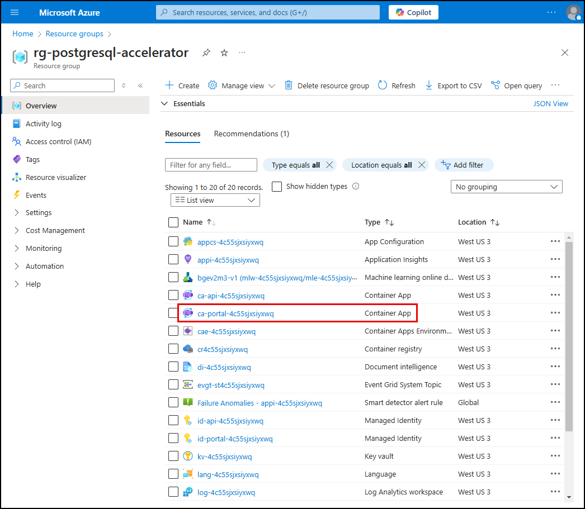

# Azureへのアプリの再デプロイ

ワークショップは、Azure Container Apps上の_Woodgrove Bank Contract Management_アプリケーションの_事前プロビジョン済み_バージョンから始まりました。アプリの要素を変更し、ローカルでテストした後、アプリケーションを_再デプロイ_したいかもしれません。

`azd`を使用してプロビジョニングとデプロイを行ったため、これは`azd up`を呼び出すだけで簡単に行えます（インフラストラクチャとアプリケーションのすべての変更をプッシュするため）し、このプロジェクトで行ったアプリケーションの変更のみを再構築してデプロイしたい場合は`azd deploy`を実行します。

!!! tip "`azd up`と`azd deploy`の違いを理解する"

    `azd up`と`azd deploy`コマンドはどちらもAzure Developer CLIの一部ですが、異なる目的を持っています：

    - `azd up`は、アプリケーションをAzureにパッケージ化、プロビジョン、デプロイするために使用されます。インフラストラクチャとアプリケーションコードを含む全体の環境をゼロからセットアップします。通常、新しいプロジェクトを開始する際やインフラストラクチャに大きな変更を加える際に使用されます。

    - `azd deploy`は、既存のデプロイメントを更新するために使用されます。環境全体を再プロビジョンする必要なく、アプリケーションに反復的な変更を加える際に役立ちます。このコマンドは、アプリケーションを頻繁に更新する継続的な開発とデプロイメントのシナリオに理想的です。

    言い換えれば、すべてを最初から設定する際には`azd up`を使用し、既存のデプロイメントを更新する際には`azd deploy`を使用します。

## 更新されたアプリのデプロイ

更新されたアプリをデプロイするには、以下の手順に従ってください：

1. Visual Studio Codeで新しい統合ターミナルを開きます。

2. リポジトリのルートにいることを確認します。

3. 変更を加えたアプリケーションをデプロイするために、このコマンドを実行します。

    !!! danger "次のAzure Developer CLIコマンドを実行してください！"

    ```bash title=""
    azd deploy
    ```

## デプロイされたアプリのテスト

1. Azureポータルで、リソースを含むリソースグループに戻り、名前が**ca-portal**で始まる**Container app**リソースを選択します。

    

2. ポータルコンテナアプリの**概要**ページの**基本情報**セクションで、**アプリケーションURL**を選択して、デプロイされたWoodgrove Bankポータルを新しいブラウザタブで開きます。

    

3. _Woodgrove Bank契約管理ポータル_で、**ダッシュボード**ページを選択し、コパイロットを使っていくつか質問をし、アプリの変更がライブであることを確認してください！

---

_お疲れ様でした！たくさんのことをカバーしましたが、心配しないでください！リポジトリのフォークがあるので、自分のペースでアイデアを再訪することができます！行く前に、いくつか重要なクリーンアップタスクを行う必要があります！_

---

!!! note "ありがとうございます: リソースをクリーンアップしてセッションを締めくくりましょう！"
