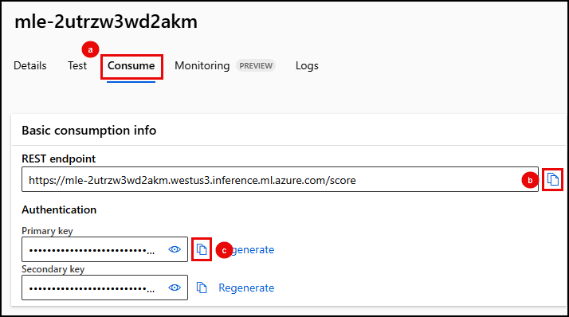

# 3.2 Azure AI 拡張機能の設定

`azure_ai` 拡張機能を使用すると、Azure OpenAI、Azure AI Language、および Azure ML サービスをデータベースに直接統合できます。拡張機能の機能を使用開始するには、各サービスのエンドポイントとサブスクリプションキーを提供して、Azure AI および ML サービスへの接続を最初に設定する必要があります。

## pgAdmin で SQL を実行して拡張機能を設定する

**pgAdmin** を使用して、データベースに対して SQL コマンドを実行することで `azure_ai` 拡張機能を設定します。

1. ローカルマシンで、**pgAdmin** の開いているインスタンスに戻り（セットアップタスクの後に閉じた場合は開いて）、PostgreSQL データベースに接続されていることを確認します。

2. pgAdmin の **Object Explorer** で、PostgreSQL サーバーの下にあるデータベースを展開します。

3. **contracts** データベースを右クリックし、コンテキストメニューから **Query Tool** を選択します。

!!! danger "以下の各タブを選択し、各 Azure AI サービスに接続するために提供された SQL ステートメントを実行してください。"

=== "Azure OpenAI"

    Azure AI 拡張機能には `azure_openai` スキーマが含まれており、[Azure OpenAI embeddings](https://learn.microsoft.com/azure/ai-services/openai/reference#embeddings) を呼び出すことで、テキスト値のベクトル表現の作成をデータベースに直接統合できます。ベクトル埋め込みは、ベクトル類似性検索に使用できます。

    1. 新しい pgAdmin クエリウィンドウで、`set_setting()` 関数を使用して Azure OpenAI への接続を設定するための次の SQL コマンドを貼り付けます。Azure OpenAI リソースのエンドポイントと API キーを取得する必要があるため、まだコマンドを実行しないでください。

        ```sql
        SELECT azure_ai.set_setting('azure_openai.endpoint', '<endpoint>');
        SELECT azure_ai.set_setting('azure_openai.subscription_key', '<api-key>');
        ```

    2. ブラウザウィンドウで、[Azure ポータル](https://portal.azure.com/) の Azure OpenAI サービスに移動します。

    3. Azure OpenAI サービスページで:

          1. **Resource Management** の下にある **Keys and Endpoint** メニュー項目を選択します。

2. **Endpoint** の値をコピーし、クエリ内の `<endpoint>` の値として貼り付け、pgAdmin クエリウィンドウで `azure_openai.endpoint` の値を設定します。

3. **KEY 1** の値をコピーし、クエリ内の `<api-key>` の値として貼り付け、pgAdmin クエリウィンドウで `azure_openai.subscription_key` の値を設定します。

   

4. pgAdmin で、**スクリプトの実行** ボタンを選択して更新された SQL コマンドを実行します。

   

5. `azure_ai` 拡張機能は、`get_setting()` 関数も提供しており、適切な権限を持つユーザーが各スキーマの `endpoint` と `key` 設定に保存されている値を表示できます。次のクエリを実行して、データベースに保存されている Azure OpenAI エンドポイントとキーの値を表示します。

    ```sql title=""
    select azure_ai.get_setting('azure_openai.endpoint');
    ```

    ```sql title=""
    select azure_ai.get_setting('azure_openai.subscription_key');
    ```

=== "Language service"

`azure_ai` 拡張機能の `azure_cognitive` スキーマに含まれる Azure AI サービスの統合は、データベースから直接アクセス可能な豊富な AI 言語機能を提供します。

1. pgAdmin クエリウィンドウで、次の SQL コマンドを貼り付けて、言語サービスへの拡張機能の接続を構成するために以前のコマンドを上書きします。まだコマンドを実行しないでください。まず、サービスのエンドポイントと API キーを取得する必要があります。

    ```sql
    SELECT azure_ai.set_setting('azure_cognitive.endpoint', '<endpoint>');
    SELECT azure_ai.set_setting('azure_cognitive.subscription_key', '<api-key>');
    ```

2. ブラウザウィンドウで、[Azure ポータル](https://portal.azure.com/) の言語サービスに移動します。

3. 言語サービスページで:

1. **リソース管理**のメニュー項目から**キーとエンドポイント**を選択します。

2. **エンドポイント**の値をコピーし、クエリ内の`<endpoint>`の値として貼り付け、pgAdminのクエリウィンドウで`azure_cognitive.endpoint`の値を設定します。

3. **KEY 1**の値をコピーし、クエリ内の`<api-key>`の値として貼り付け、pgAdminのクエリウィンドウで`azure_cognitive.subscription_key`の値を設定します。

   

4. pgAdminで、**スクリプトを実行**ボタンを選択して更新されたSQLコマンドを実行します。

=== "Azure ML (オプション)"

Azure AI拡張機能を使用すると、SQL内からAzure Machine Learning (ML) のオンラインエンドポイントにデプロイされた任意の機械学習モデルを呼び出すことができます。これらのモデルはAzure MLカタログからのものや、トレーニングされデプロイされたカスタムモデルである可能性があります。

!!! warning "azd upデプロイメント中に`deployAMLModel`をTRUEに選択した場合のみ、Azure MLエンドポイントを構成してください。"

1. pgAdminのクエリウィンドウで、以下のSQLコマンドを貼り付けて、拡張機能のAzure MLへの接続を構成するために前のコマンドを上書きします。まだコマンドを実行しないでください。まず、Azure MLにデプロイされたモデルのエンドポイントとキーを取得する必要があります。

    ```sql
    SELECT azure_ai.set_setting('azure_ml.scoring_endpoint','<endpoint>');
    SELECT azure_ai.set_setting('azure_ml.endpoint_key', '<api-key>');
    ```

2. ブラウザウィンドウで、[Azureポータル](https://portal.azure.com/)のAzure MLワークスペースに移動します。

3. Azure MLワークスペースページから、**スタジオを起動**ボタンを選択して、新しいブラウザウィンドウでAzure Machine Learning Studioを開きます。

   

    4. プロンプトが表示されたら、Machine Learning Studio にサインインします。

    5. Machine Learning Studio で、左側のリソースメニューの **Assets** の下にある **Endpoints** を選択し、`bge-v2-m3-reranker model` のエンドポイントを選択します。

        

    6. エンドポイントページで次の操作を行います。

       1. **Consume** タブを選択します。
       2. **REST endpoint** の値をコピーし、クエリ内の `<endpoint>` の値として貼り付け、pgAdmin クエリウィンドウで `azure_ml.scoring_endpoint` の値を設定します。
       3. **Primary key** の値をコピーし、クエリ内の `<api-key>` の値として貼り付け、pgAdmin クエリウィンドウで `azure_ml.endpoint_key` の値を設定します。
       
           
        
    7.  pgAdmin で、**Execute script** ボタンを選択して更新された SQL コマンドを実行します。

!!! danger "データベース内のすべてのサービス（Azure OpenAI、Language Service、Azure Machine Learning）のエンドポイントとキーを追加するスクリプトを必ず実行してください。"
