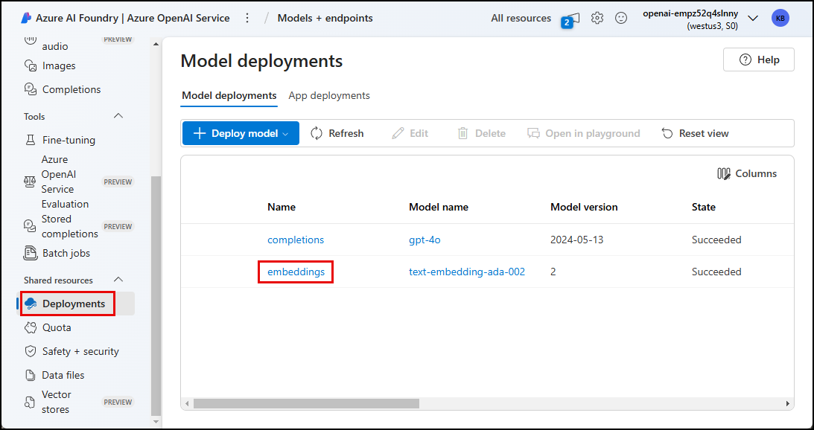

# 3.5 データのベクトル化

Azure OpenAI の `text-embedding-ada-002` などの埋め込みモデルを活用することで、テキストデータのベクトル表現を生成し、Azure Database for PostgreSQL - Flexible Server のようなベクトルストアに保存することができます。このアプローチにより、効率的で正確な類似性検索が可能になり、関連情報の取得や文脈に富んだインタラクションの提供が大幅に向上します。

`azure_ai` 拡張機能によってインストールされる `azure_openai` スキーマには、`create_embeddings()` 関数が含まれています。この関数を使用すると、Azure OpenAI にデプロイされた埋め込みモデルをクエリから直接呼び出して、テキスト入力の埋め込みを生成できます。

```sql title="create_embeddings() 関数の関数シグネチャ"
-- Single text input
azure_openai.create_embeddings(deployment_name text, input text, timeout_ms integer DEFAULT 3600000, throw_on_error boolean DEFAULT true, max_attempts integer DEFAULT 1, retry_delay_ms integer DEFAULT 1000)

-- Array of input text
azure_openai.create_embeddings(deployment_name text, input text[], batch_size integer DEFAULT 100, timeout_ms integer DEFAULT 3600000, throw_on_error boolean DEFAULT true, max_attempts integer DEFAULT 1, retry_delay_ms integer DEFAULT 1000)
```

!!! tip "`create_embeddings()` 関数、そのオーバーロード、および期待される引数の詳細については、[関数ドキュメント](https://learn.microsoft.com/azure/postgresql/flexible-server/generative-ai-azure-openai#azure_openaicreate_embeddings)をご覧ください。"

## 埋め込みの生成

`azure_ai` 拡張機能により、Azure OpenAI 埋め込み API の呼び出しが簡単になります。最も単純な形式では、`create_embeddings()` 関数は、以下のように `deployment_name` と `input` の2つの引数で呼び出すことができます。

```sql
SELECT azure_openai.create_embeddings(deployment_name, input)
```

SQL クエリを通じてベクトル埋め込みを生成する方法を示すために、**pgAdmin** で次のクエリを実行します。

1. ローカルマシンで開いている **pgAdmin** インスタンスに戻り、PostgreSQL データベースに接続されていることを確認します。

2. pgAdmin の **Object Explorer** で、PostgreSQL サーバーの下にあるデータベースを展開します。

3. **contracts** データベースを右クリックし、コンテキストメニューから **Query Tool** を選択します。

4. 次のクエリを実行します。このクエリは、`invoice_validation_results` テーブルの `result` フィールドに対してベクトル埋め込みを作成します。関数の `deployment_name` パラメータは `embeddings` に設定されています。これは、Azure OpenAI サービスでの `text-embedding-ada-002` モデルのデプロイメント名です（Bicep デプロイメントスクリプトによってその名前で作成されました）。


!!! danger "以下のSQLコマンドを実行してください！"

```sql
SELECT 
        invoice_id,
        azure_openai.create_embeddings('embeddings', result) AS embedding
    FROM invoice_validation_results
    LIMIT 1;
```

!!! tip "Azure AI Foundryで埋め込みモデルのデプロイ名を確認できます。"

1. Azure OpenAIサービスのランディングページからAzure AI Foundryを開きます。
2. Azure AI Foundryで、リソースナビゲーションメニューから**Deployments**オプションを選択します。
3. `text-embedding-ada-002`モデルに関連付けられた**Name**を確認します。

   

5. クエリの結果は次のようになります：

```sql
   id |                              embedding
------+-------------------------------------------------------------------------
    1 | {-0.031766646,-0.033289704,0.0009468119,...,0.016508864,0.031440277}
```

ベクトルの1,536次元は、簡潔さのために上記の出力で省略されています。

## 既存データのベクトル化

`deliverables`、`invoice_line_items`、`invoice_validation_results`、`sow_chunks`、および`sow_validation_results`テーブルに`vector`列を追加しました。これから、SQLの`UPDATE`文で`azure_openai.create_embeddings()`関数を使用して、各テーブルに既にあるテキストデータの埋め込みを生成します。

!!! warning "各テーブルクエリは、設定されたTPM制限に応じて数分かかる場合があります。"

**pgAdmin**を使用して、各テーブルのSQL文を実行します。

!!! danger "_以下の各テーブルのタブを選択し、指定された列の埋め込みを作成するために`UPDATE`文を実行してください。_"

=== "deliverables"

pgAdminの新しいクエリウィンドウに次のSQL文をコピーして貼り付け、クエリを実行します。

```sql
UPDATE deliverables
SET embedding = azure_openai.create_embeddings('embeddings', description, max_attempts => 5, retry_delay_ms => 500)
WHERE embedding IS NULL;
```

=== "invoice_line_items"

pgAdminの新しいクエリウィンドウに次のSQL文をコピーして貼り付け、クエリを実行します。

```sql
UPDATE invoice_line_items
SET embedding = azure_openai.create_embeddings('embeddings', description, max_attempts => 5, retry_delay_ms => 500)
WHERE embedding IS NULL;
```

=== "invoice_validation_results"

pgAdminの新しいクエリウィンドウに次のSQL文をコピー＆ペーストし、クエリを実行してください。

```sql
UPDATE invoice_validation_results
SET embedding = azure_openai.create_embeddings('embeddings', result, max_attempts => 5, retry_delay_ms => 500)
WHERE embedding IS NULL;
```

=== "sow_chunks"

pgAdminの新しいクエリウィンドウに次のSQL文をコピー＆ペーストし、クエリを実行してください。

```sql
UPDATE sow_chunks
SET embedding = azure_openai.create_embeddings('embeddings', content, max_attempts => 5, retry_delay_ms => 500)
WHERE embedding IS NULL;
```

=== "sow_validation_results"

pgAdminの新しいクエリウィンドウに次のSQL文をコピー＆ペーストし、クエリを実行してください。

```sql
UPDATE sow_validation_results
SET embedding = azure_openai.create_embeddings('embeddings', result, max_attempts => 5, retry_delay_ms => 500)
WHERE embedding IS NULL;
```

!!! danger "次のステップに進む前に、すべてのテーブルに対して`UPDATE`文を実行し、すべての埋め込みを作成してください。"

!!! info "トリガーを使用してデータベース`INSERT`で埋め込みを生成"

このアプリケーションのコードは、データベースの`INSERT`コマンド内で直接ベクトル埋め込みを生成するために`azure_openai`拡張機能を呼び出します。テーブルに`INSERT`トリガーを使用する方が便利な場合もあります。トリガーは、テーブルに行が挿入されるたびに自動的に埋め込みを生成します。

以下は、`sow_chunks`テーブルでベクトル埋め込みを生成するための`INSERT`トリガーの例です：

```sql title="埋め込みを生成するための例のINSERTトリガー"
-- create function that generates embeddings
    CREATE OR REPLACE FUNCTION sow_chunks_insert_trigger_fn()
    RETURNS trigger AS $$
    BEGIN
      IF NEW.content IS NOT NULL THEN
        NEW.embeddings := azure_openai.create_embeddings('embeddings', NEW.content, throw_on_error => FALSE, max_attempts => 1000, retry_delay_ms => 2000);
      END IF;
      RETURN NEW;
    END;
    $$ LANGUAGE plpgsql;
    -- setup INSERT TRIGGER to call function
    CREATE TRIGGER sow_chunks_insert_trigger
    BEFORE INSERT ON sow_chunks
    FOR EACH ROW
    EXECUTE FUNCTION sow_chunks_insert_trigger_fn();
```
