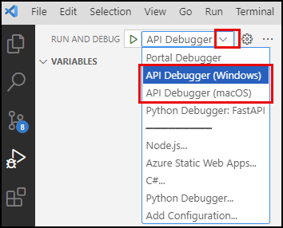

# 6.8 GraphRAGでCopilotを更新する

次のステップは、データ取得にGraphRAGを使用するようにAPIを更新することです。これにより、コパイロットが未払いの請求書を見つけて取得する方法を更新します。

## 関数の確認

LangChainエージェントがデータベースからデータを取得するために使用する_関数呼び出し_パターンに従って、Python関数を使用してコパイロットからグラフデータベースに対してopenCypherクエリを実行します。`src/api/app/functions/chat_functions.py`ファイル内には、cypherクエリを実行するための`get_unpaid_invoices_for_vendor`関数が用意されています。今すぐVisual Studio Codeで開き、関数のコードを確認してください。以下のセクションを展開して、インラインでコードを見ることもできます。

???+ info "GraphRAGコード"

    ```python linenums="1" title="src/api/app/functions/chat_functions.py"
    async def get_unpaid_invoices_for_vendor(self, vendor_id: int):
        """
        Retrieves a list of unpaid invoices for a specific vendor using a graph query.
        """
        # Define the graph query
        graph_query = f"""SELECT * FROM ag_catalog.cypher('vendor_graph', $$
        MATCH (v:vendor {{id: '{vendor_id}'}})-[rel:has_invoices]->(s:sow)
        WHERE rel.payment_status <> 'Paid'
        RETURN v.id AS vendor_id, v.name AS vendor_name, s.id AS sow_id, s.number AS sow_number, rel.id AS invoice_id, rel.number AS invoice_number, rel.payment_status AS payment_status
        $$) as (vendor_id BIGINT, vendor_name TEXT, sow_id BIGINT, sow_number TEXT, invoice_id BIGINT, invoice_number TEXT, payment_status TEXT);
        """
        rows = await self.__execute_graph_query(graph_query)
        return [dict(row) for row in rows]
    ```

1. **グラフィークエリの定義** (6行目): 指定された`vendor_id`の未払い請求書を検索するために使用されるcypherクエリを作成します。

2. **cypherクエリの実行** (12行目): `__execute_graph_query()`関数を使用して、cypherクエリをデータベースに送信して実行します。

   1. `chat_functions.py`ファイルの25行目から始まる`__execute_graph_query()`関数は、グラフデータベースを含む`ag_catalog`スキーマに対してクエリを実行します。これを可能にするために、グラフクエリを実行する前に`SET`クエリを含めて、接続の`search_path`に`ag_catalog`を追加します。

3. **結果の返却** (13行目): クエリ結果を抽出し、LLMに返します。

## GraphRAGの実装

コパイロットにGraphRAG機能を実装するには、LangChainエージェントの`tools`コレクションに`get_unpaid_invoices_for_vendor`関数を含める必要があります。この関数をエージェントの利用可能なツールのリストに追加します。

1. VS Codeの**エクスプローラー**で、`src/api/app/routers`フォルダーに移動し、`completions.py`ファイルを開きます。

2. `tools`配列内で、次の行を見つけます (75行目):

    ```python
    StructuredTool.from_function(coroutine=cf.get_invoices),
    ```

3. 次のコードをその直下の行に挿入します:

    !!! danger "GraphRAG関数を追加するために次のPythonコードを挿入してください！"

    ```python
    StructuredTool.from_function(coroutine=cf.get_unpaid_invoices_for_vendor),
    ```

4. 新しい `tools` 配列は次のようになります:

    ```python hl_lines="14"
    # Define tools for the agent to retrieve data from the database
    tools = [
        # Hybrid search functions
        StructuredTool.from_function(coroutine=cf.find_invoice_line_items),
        StructuredTool.from_function(coroutine=cf.find_invoice_validation_results),
        StructuredTool.from_function(coroutine=cf.find_milestone_deliverables),
        StructuredTool.from_function(coroutine=cf.find_sow_chunks_with_semantic_ranking),
        StructuredTool.from_function(coroutine=cf.find_sow_validation_results),
        # Get invoice data functions
        StructuredTool.from_function(coroutine=cf.get_invoice_id),
        StructuredTool.from_function(coroutine=cf.get_invoice_line_items),
        StructuredTool.from_function(coroutine=cf.get_invoice_validation_results),
        StructuredTool.from_function(coroutine=cf.get_invoices),
        StructuredTool.from_function(coroutine=cf.get_unpaid_invoices_for_vendor),
        # Get SOW data functions
        StructuredTool.from_function(coroutine=cf.get_sow_chunks),
        StructuredTool.from_function(coroutine=cf.get_sow_id),
        StructuredTool.from_function(coroutine=cf.get_sow_milestones),
        StructuredTool.from_function(coroutine=cf.get_milestone_deliverables),
        StructuredTool.from_function(coroutine=cf.get_sow_validation_results),
        StructuredTool.from_function(coroutine=cf.get_sows),
        # Get vendor data functions
        StructuredTool.from_function(coroutine=cf.get_vendors)
    ]
    ```

5. `completions.py` ファイルを保存します。

## VS Codeでテストする

以前と同様に、Visual Studio Codeを使用して更新をテストします。

### APIを開始する

VS CodeでAPIのデバッグセッションを開始するために、以下の手順に従ってください。

1. Visual Studio Codeの **実行とデバッグ** パネルで、デバッグ構成のドロップダウンリストからOSに対応する **API Debugger** オプションを選択します。

    

2. **デバッグ開始** ボタンを選択します（またはキーボードのF5キーを押します）。

    

3. ターミナル出力に `Application startup complete.` というメッセージが表示されるまで、APIアプリケーションが完全に起動するのを待ちます。

    

### ポータルを開始する

APIが実行中の場合、VS Codeでポータルプロジェクトの2つ目のデバッグセッションを開始できます。

1. Visual Studio Codeの **実行とデバッグ** パネルに戻り、デバッグ構成のドロップダウンリストから **Portal Debugger** オプションを選択します。

    

2. **デバッグ開始** ボタンを選択します（またはキーボードのF5キーを押します）。

    

3. これにより、新しいブラウザウィンドウで _Woodgrove Bank Contract Management Portal_ が起動します (<http://localhost:3000/>)。

4. **Dashboard** ページのコパイロットチャットで、次のメッセージを入力して送信します：

    !!! danger "次のプロンプトをコパイロットチャットボックスに貼り付けてください！"

    ```ini title=""
    Adatumからの未払い請求書の正確性について教えてください。
    ```

5. GraphRAGを使用して提供された結果を観察します。

    !!! tip "GraphRAGは正確性を向上させます"

        `chat_functions.py` ファイルの `get_unpaid_invoices_for_vendor` 関数にブレークポイントを追加します。このブレークポイントにより、グラフクエリの実行を確認し、残りの関数呼び出しをステップ実行して、請求書の検証結果が未払いの請求書に対してのみ取得されることを観察できます。この精度により、データベースから返されるデータが削減され、RAGパターンが応答を生成するために必要なデータのみを受け取ることができます。

!!! success "おめでとうございます！Azure Database for PostgreSQLとAGEのGraphRAG機能を活用する方法を学びました！"
